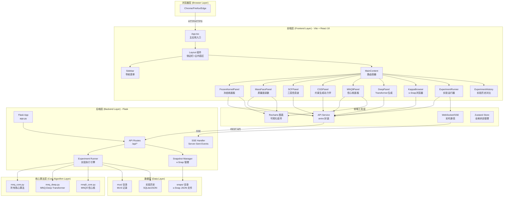
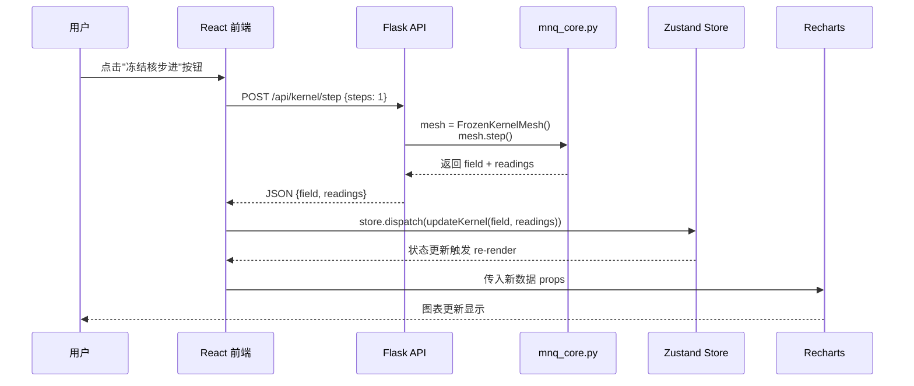
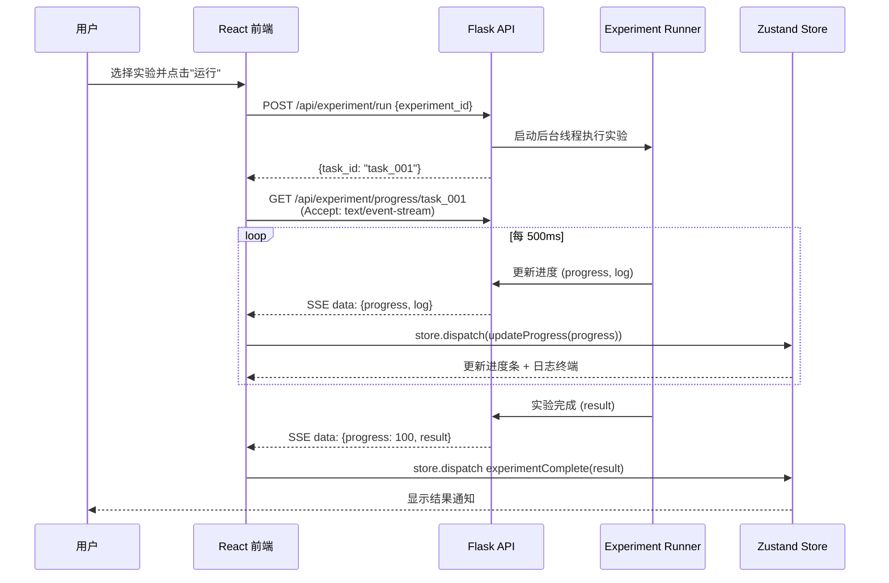
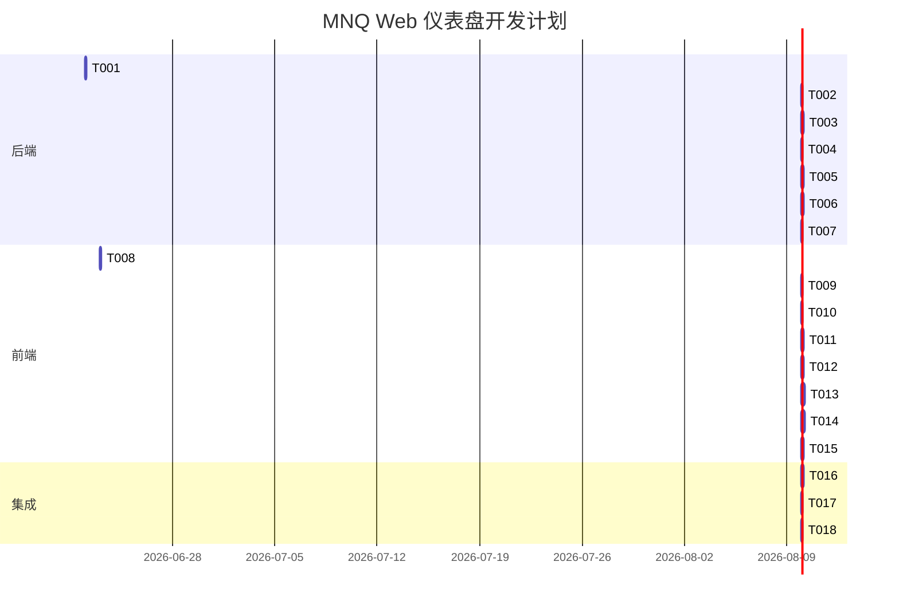

# MNQ 金灵球网络仿真器 Web 仪表盘 - 系统架构设计

**版本**: v1.0  
**日期**: 2026-06-21  
**架构师**: 高见远（Gao）  
**项目**: MNQ 金灵球网络仿真器 v3.1 Web 升级版

---

## 1. 系统架构概览

### 1.1 架构图 (Mermaid)



### 1.2 架构分层说明

| 层级 | 技术栈 | 职责 |
|------|---------|------|
| **浏览器层** | Chrome/Firefox/Edge | 用户界面展示，交互操作 |
| **前端层** | Vite + React 18 + MUI + Tailwind CSS | SPA 应用，组件化 UI，状态管理 |
| **前端工具层** | axios + Recharts + Zustand | API 调用，图表渲染，全局状态 |
| **后端层** | Flask + Flask-CORS | REST API，SSE 实时通信，实验调度 |
| **核心算法层** | mnq_core.py + mnq_deep.py + mnq9_core.py | MNQ 所有算法实现 |
| **数据层** | 文件系统 (JSON) + SQLite | κ-Snap 存储，实验历史，MUS 记录 |

---

## 2. 技术选型理由

### 2.1 后端: Flask

**选择理由**:
1. **轻量级**: Flask 是微框架，适合封装已有 Python 算法模块
2. **快速开发**: 无需复杂配置，直接 import mnq_core.py 即可使用
3. **灵活性**: 可以自由组织 API 路由，支持 SSE（Server-Sent Events）
4. **生态成熟**: 丰富的扩展（flask-cors, flask-sqlalchemy 等）

**替代方案对比**:
- **FastAPI**: 类型安全、自动生成文档，但需要修改现有代码添加类型注解
- **Django**: 过重，不适合此项目的算法封装场景
- **选择 Flask**: 最快速实现，最小改动封装 mnq_core.py

### 2.2 前端: Vite + React 18 + MUI + Tailwind CSS

**选择理由**:
1. **Vite**: 极速 HMR（热模块替换），开发体验优秀
2. **React 18**: 并发特性，Suspense，成熟的生态系统
3. **MUI (Material UI)**: 开箱即用的企业级组件库，支持主题定制
4. **Tailwind CSS**: 实用优先的 CSS 框架，快速实现自定义布局

**Dark Theme 定制**:
- 主色: `#1890ff` (科技蓝)
- 背景色: `#1a1a2e` (深紫黑)
- 面板色: `#16213e` (深蓝)
- 卡片色: `#0f3460` (中蓝)
- 强调色: `#e94560` (红), `#00d4ff` (青), `#ffd700` (金)

### 2.3 图表: Recharts

**选择理由**:
1. **React 原生**: 基于 React 组件，无需 jQuery 等依赖
2. **声明式**: 组件化配置，易于与 React 状态集成
3. **暗色主题支持**: 可定制颜色，适配深色科技主题
4. **响应式**: 自动适配容器尺寸

**替代方案**:
- **ECharts**: 功能更强大，但体积大，React 封装不够原生
- **D3.js**: 最灵活，但学习曲线陡峭，开发效率低

### 2.4 状态管理: Zustand

**选择理由**:
1. **轻量**: 无 Provider 嵌套，API 简洁
2. **高性能**: 基于 Proxy，精准渲染
3. **TypeScript 友好**: 类型推断良好
4. **适合中等复杂度**: 此项目的状态管理需求适中

**替代方案**:
- **Redux Toolkit**: 过重，样板代码多
- **React Context**: 性能差，不适合高频更新（如实时图表）

### 2.5 实时通信: Server-Sent Events (SSE)

**选择理由**:
1. **单向流式**: 适合实验进度推送（后端 → 前端）
2. **自动重连**: 浏览器原生支持
3. **简单**: 基于 HTTP，无需 WebSocket 握手

**使用场景**:
- 长时间运行的实验（如 SCF 收敛）
- 冻结核多步演化进度
- 实验日志流式输出

---

## 3. 后端 API 设计

### 3.1 REST API 路由表

#### 3.1.1 实验管理 API

| 方法 | 路径 | 描述 | 请求体 | 响应 |
|------|------|------|--------|------|
| GET | `/api/experiment/list` | 获取所有可用实验列表 | - | `{experiments: [{id, name, description}]}` |
| POST | `/api/experiment/run` | 运行指定实验 | `{experiment_id, params}` | `{task_id, status}` |
| GET | `/api/experiment/status/<task_id>` | 查询实验状态 | - | `{status, progress, result}` |
| GET | `/api/experiment/progress/<task_id>` | SSE 流式进度 | - | `data: {progress, log}` |
| GET | `/api/experiment/history` | 获取实验历史列表 | - | `{history: [{id, name, timestamp, status}]}` |
| GET | `/api/experiment/history/<id>` | 获取指定历史记录 | - | `{experiment_id, params, result, timestamp}` |
| DELETE | `/api/experiment/history/<id>` | 删除指定历史记录 | - | `{success}` |

#### 3.1.2 FrozenKernel (冻结核) API

| 方法 | 路径 | 描述 | 请求体 | 响应 |
|------|------|------|--------|------|
| GET | `/api/kernel/status` | 获取冻结核当前状态 | - | `{step_count, field, fingerprint}` |
| POST | `/api/kernel/step` | 执行单步演化 | `{steps: 1}` | `{field, readings}` |
| POST | `/api/kernel/reset` | 重置冻结核 | `{seed, condition}` | `{success}` |
| GET | `/api/kernel/readings` | 获取 MASS_FACE 读数 | - | `{MASS_FACE, LOCAL_COMP_LOOP, ...}` |
| GET | `/api/kernel/fingerprint` | 获取 SHA256 指纹 | - | `{fingerprint, verified}` |
| POST | `/api/kernel/d4-audit` | 执行 D4 协变审计 | - | `{results: [{transform, covariant}]}` |

#### 3.1.3 MASS_FACE 读数 API

| 方法 | 路径 | 描述 | 请求体 | 响应 |
|------|------|------|--------|------|
| GET | `/api/massface/read` | 读取质量面复合读数 | - | `{MASS_FACE, LOCAL_COMP_LOOP, LOOP_HOLD_13, ...}` |
| GET | `/api/massface/history` | 获取历史读数 | `{limit: 200}` | `{history: [{timestamp, readings}]}` |

#### 3.1.4 SCF (三层信息波) API

| 方法 | 路径 | 描述 | 请求体 | 响应 |
|------|------|------|--------|------|
| GET | `/api/scf/status` | 获取 SCF 状态 | - | `{core, bagua_mean, hex64_mean, converged, max_change}` |
| POST | `/api/scf/step` | 执行一步 SCF 迭代 | `{steps: 1}` | `{snapshot, max_change}` |
| POST | `/api/scf/run-to-convergence` | 运行至收敛 | `{max_steps: 200, epsilon: 1e-6}` | `{steps, converged, snapshot}` |

#### 3.1.5 CGD (约束生成动力学) API

| 方法 | 路径 | 描述 | 请求体 | 响应 |
|------|------|------|--------|------|
| GET | `/api/cgd/status` | 获取 CGD 约束状态 | - | `{constraints: [{name, target_range, current_value, modulation}]}` |
| GET | `/api/cgd/violation` | 获取约束违反度 | - | `{violation, is_legal, steady_states_count}` |
| POST | `/api/cgd/add-constraint` | 添加约束 | `{name, target_range, modulation}` | `{success}` |
| POST | `/api/cgd/modulate` | 执行弱调制 | `{state_vector}` | `{modulated_vector}` |

#### 3.1.6 MNQ9 (信心核) API

| 方法 | 路径 | 描述 | 请求体 | 响应 |
|------|------|------|--------|------|
| GET | `/api/mnq9/status` | 获取 MNQ9 状态 | - | `{omega, B_conf, kernel, history_length}` |
| POST | `/api/mnq9/set-macro` | 设置宏观信心场 | `{M2, PMI, DR007, ...}` | `{success}` |
| POST | `/api/mnq9/set-future` | 设置未来事件波 | `{phi_series: []}` | `{success}` |
| POST | `/api/mnq9/run-series` | 运行趋势模拟 | `{steps: 60}` | `{omega_series, B_conf_series, report}` |
| GET | `/api/mnq9/scenario/<name>` | 应用预定义场景 | - | `{macro, events}` |

#### 3.1.7 MNQ-Deep Transformer API

| 方法 | 路径 | 描述 | 请求体 | 响应 |
|------|------|------|--------|------|
| POST | `/api/deep/generate` | 生成文本 | `{start_text, length, temperature, syntax_constraint}` | `{generated_text}` |
| POST | `/api/deep/train` | 训练模型 | `{dataset_text, epochs, batch_size, lr}` | `{losses}` |
| GET | `/api/deep/status` | 获取模型状态 | - | `{device, vocab_size, model_loaded}` |

#### 3.1.8 κ-Snap 浏览器 API

| 方法 | 路径 | 描述 | 请求体 | 响应 |
|------|------|------|--------|------|
| GET | `/api/kappa/list` | 列出所有快照 | `{limit: 50}` | `{snapshots: [{id, timestamp, experiment, fingerprint}]}` |
| GET | `/api/kappa/<snap_id>` | 获取指定快照 | - | `{snapshot: {field, readings, metadata}}` |
| GET | `/api/kappa/<snap_id>/download` | 下载快照 JSON | - | `file: application/json` |
| DELETE | `/api/kappa/<snap_id>` | 删除指定快照 | - | `{success}` |
| POST | `/api/kappa/export` | 导出当前状态为快照 | `{experiment_id}` | `{snap_id, file_path}` |

#### 3.1.9 金灵球网格 API

| 方法 | 路径 | 描述 | 请求体 | 响应 |
|------|------|------|--------|------|
| GET | `/api/mesh/status` | 获取网格状态 | - | `{dim_x, dim_y, total_mass, mass_face_count, step_count}` |
| GET | `/api/mesh/field` | 获取流贯场数组 | - | `{field: [[], []]}` |
| GET | `/api/mesh/mass-face` | 获取质量面数组 | - | `{mass_faces: [[], []]}` |
| GET | `/api/mesh/excess-loop` | 获取 Oloid 差分数组 | - | `{excess_loop: [[], []]}` |
| POST | `/api/mesh/seed` | 初始化网格种子 | `{mode: "background" \| "zero_field" \| "hex_ring_gap"}` | `{success}` |
| POST | `/api/mesh/step` | 执行一步演化 | `{dt: 0.016}` | `{stats}` |

#### 3.1.10 Liu Scheduler (刘机制) API

| 方法 | 路径 | 描述 | 请求体 | 响应 |
|------|------|------|--------|------|
| POST | `/api/liu/find-path` | 追踪最优路径 | `{source: [x, y]}` | `{path: [[x1,y1], ...], min_s_rel}` |

#### 3.1.11 MNQ Cloud API

| 方法 | 路径 | 描述 | 请求体 | 响应 |
|------|------|------|--------|------|
| POST | `/api/cloud/simulate` | 运行 Cloud 仿真 | `{unit_mode, experiment, steps, epsilon, seed}` | `{mean_energy_J, coerence, ...}` |

### 3.2 API 请求/响应示例

#### 示例 1: 运行实验

**请求**:
```http
POST /api/experiment/run
Content-Type: application/json

{
  "experiment_id": "HEX_RING_GAP",
  "params": {
    "steps": 1000,
    "dt": 0.016
  }
}
```

**响应**:
```json
{
  "task_id": "task_20260621_001",
  "status": "running",
  "message": "Experiment started"
}
```

#### 示例 2: SSE 进度流

**请求**:
```http
GET /api/experiment/progress/task_20260621_001
Accept: text/event-stream
```

**响应流**:
```
data: {"progress": 10, "log": "Step 100: Mass=0.1234"}

data: {"progress": 20, "log": "Step 200: Mass=0.2345"}

data: {"progress": 100, "log": "Experiment completed", "result": {"mass": 0.3456, "loop": 0.0567}}
```

#### 示例 3: 获取 FrozenKernel 读数

**请求**:
```http
GET /api/kernel/readings
```

**响应**:
```json
{
  "MASS_FACE": 0.1234,
  "LOCAL_COMP_LOOP": 0.0567,
  "LOOP_HOLD_13": 2,
  "BOUNDARY_LEAK": 0.0012,
  "DIAG_MINUS_AXIS_LOOP": 0.0345,
  "timestamp": "2026-06-21T15:30:45Z"
}
```

---

## 4. 前端组件树

### 4.1 完整组件层级 (Mermaid)

```mermaid
graph TD
    A[App.tsx] --> B[ThemeProvider<br/>MUI 主题]
    A --> C[Router<br/>react-router-dom]
    A --> D[Store Provider<br/>Zustand]
    
    C --> E[Layout.tsx]
    
    E --> F[Sidebar.tsx<br/>侧边栏导航]
    E --> G[MainContent.tsx<br/>主内容区]
    E --> H[TopBar.tsx<br/>顶部状态栏]
    
    F --> F1[NavItem: 实验运行器]
    F --> F2[NavItem: FrozenKernel]
    F --> F3[NavItem: MASS_FACE]
    F --> F4[NavItem: SCF/CGD]
    F --> F5[NavItem: MNQ9]
    F --> F6[NavItem: MNQ-Deep]
    F --> F7[NavItem: κ-Snap]
    F --> F8[NavItem: 实验历史]
    
    G --> G1[ExperimentRunner.tsx]
    G --> G2[FrozenKernelPanel.tsx]
    G --> G3[MassFacePanel.tsx]
    G --> G4[SCFPanel.tsx]
    G --> G5[CGDPanel.tsx]
    G --> G6[MNQ9Panel.tsx]
    G --> G7[DeepPanel.tsx]
    G --> G8[KappaBrowser.tsx]
    G --> G9[ExperimentHistory.tsx]
    
    G1 --> G1a[ExperimentList.tsx<br/>实验列表]
    G1 --> G1b[OutputTerminal.tsx<br/>输出日志终端]
    G1 --> G1c[ParamForm.tsx<br/>参数表单]
    
    G2 --> G2a[StatusCards.tsx<br/>状态卡片]
    G2 --> G2b[FieldHeatmap.tsx<br/>场热力图]
    G2 --> G2c[ReadingsChart.tsx<br/>读数折线图]
    G2 --> G2d[ParamSliders.tsx<br/>参数滑块]
    
    G3 --> G3a[GaugeChart.tsx<br/>仪表盘]
    G3 --> G3b[MetricCards.tsx<br/>指标卡片]
    G3 --> G3c[HistoryChart.tsx<br/>历史图表]
    
    G4 --> G4a[InfoWaveChart.tsx<br/>三层信息波图表]
    G4 --> G4b[ConvergenceStatus.tsx<br/>收敛状态]
    
    G5 --> G5a[ConstraintList.tsx<br/>约束列表]
    G5 --> G5b[ViolationChart.tsx<br/>违反度图表]
    
    G6 --> G6a[ConfidenceChart.tsx<br/>信心趋势图]
    G6 --> G6b[ScenarioSelector.tsx<br/>场景选择器]
    
    G7 --> G7a[GenerateForm.tsx<br/>生成表单]
    G7 --> G7b[OutputDisplay.tsx<br/>输出展示]
    
    G8 --> G8a[SnapshotList.tsx<br/>快照列表]
    G8 --> G8b[SnapshotViewer.tsx<br/>快照查看器]
    G8 --> G8c[ExportButton.tsx<br/>导出按钮]
    
    G9 --> G9a[HistoryList.tsx<br/>历史列表]
    G9 --> G9b[ComparisonChart.tsx<br/>对比图表]
    
    H --> H1[StatusIndicator.tsx<br/>系统状态]
    H --> H2[UserMenu.tsx<br/>用户菜单]
    H --> H3[SettingsButton.tsx<br/>设置按钮]
```



### 4.2 关键组件说明

#### 4.2.1 Layout 组件

**文件路径**: `frontend/src/components/Layout.tsx`

**功能**:
- 左侧边栏（可折叠）
- 顶部状态栏
- 主内容区（路由出口）

**状态**:
- `sidebarCollapsed: boolean`
- `currentNav: string`

#### 4.2.2 ExperimentRunner 组件

**文件路径**: `frontend/src/pages/ExperimentRunner.tsx`

**功能**:
- 18 种实验列表（参考 `mnq_dashboard.py` 的 `run_cli_simulation`）
- 参数配置表单
- 输出日志终端（仿终端样式，黑色背景 + 绿色文字）
- 进度条（配合 SSE）

**子组件**:
- `ExperimentList.tsx`: 实验列表（卡片或表格）
- `OutputTerminal.tsx`: 日志输出（使用 `<pre>` + 自动滚动）
- `ParamForm.tsx`: 动态参数表单（根据实验类型渲染）

#### 4.2.3 FrozenKernelPanel 组件

**文件路径**: `frontend/src/pages/FrozenKernelPanel.tsx`

**功能**:
- 冻结核状态卡片（step_count, fingerprint）
- 8x8 场热力图（使用 Recharts 的 Heatmap）
- MASS_FACE 读数实时更新
- 参数滑块（seed, condition）
- 单步/连续演化按钮

**图表**:
- `FieldHeatmap.tsx`: 8x8 热力图（3 个通道分别显示）
- `ReadingsChart.tsx`: MASS_FACE 历史折线图

#### 4.2.4 MassFacePanel 组件

**文件路径**: `frontend/src/pages/MassFacePanel.tsx`

**功能**:
- 仪表盘样式显示 MASS_FACE 读数
- 数字指标卡片（MASS_FACE, LOCAL_COMP_LOOP, LOOP_HOLD_13 等）
- 历史趋势图

**图表**:
- `GaugeChart.tsx`: 仪表盘（使用 Recharts 的 RadialBarChart）
- `HistoryChart.tsx`: 多指标历史折线图

#### 4.2.5 KappaBrowser 组件

**文件路径**: `frontend/src/pages/KappaBrowser.tsx`

**功能**:
- 快照列表（时间、实验、指纹）
- 快照查看器（JSON 树形展示）
- 导出按钮（下载 JSON）
- 删除按钮

---

## 5. 文件结构

### 5.1 完整文件列表

```
mnq_windows/
├── backend/                          # 后端目录
│   ├── app.py                       # Flask 应用入口
│   ├── config.py                    # 配置文件 (CORS, 端口等)
│   ├── requirements.txt             # Python 依赖
│   ├── api/                       # API 路由模块
│   │   ├── __init__.py
│   │   ├── experiment.py          # 实验管理 API
│   │   ├── kernel.py             # FrozenKernel API
│   │   ├── massface.py          # MASS_FACE API
│   │   ├── scf.py              # SCF API
│   │   ├── cgd.py              # CGD API
│   │   ├── mnq9.py             # MNQ9 API
│   │   ├── deep.py             # MNQ-Deep API
│   │   ├── kappa.py            # κ-Snap API
│   │   ├── mesh.py             # 金灵球网格 API
│   │   ├── liu.py              # 刘机制 API
│   │   └── cloud.py            # MNQ Cloud API
│   ├── services/                   # 业务逻辑层
│   │   ├── __init__.py
│   │   ├── experiment_runner.py  # 实验执行引擎
│   │   ├── snapshot_manager.py   # 快照管理
│   │   └── sse_manager.py       # SSE 连接管理
│   ├── models/                    # 数据模型 (如果使用 ORM)
│   │   ├── __init__.py
│   │   └── experiment_history.py # 实验历史模型
│   └── utils/                     # 工具函数
│       ├── __init__.py
│       └── helpers.py            # 辅助函数
│
├── frontend/                       # 前端目录
│   ├── index.html                 # HTML 入口
│   ├── package.json              # Node.js 依赖
│   ├── vite.config.ts           # Vite 配置
│   ├── tsconfig.json             # TypeScript 配置
│   ├── tailwind.config.js        # Tailwind CSS 配置
│   ├── postcss.config.js         # PostCSS 配置
│   ├── public/                   # 静态资源
│   │   └── favicon.svg
│   └── src/                     # 源代码
│       ├── main.tsx              # 应用入口
│       ├── App.tsx               # 根组件
│       ├── index.css             # 全局样式
│       ├── theme.ts              # MUI 主题配置
│       ├── api/                  # API 调用层
│       │   ├── client.ts         # axios 实例
│       │   ├── experiment.ts     # 实验 API
│       │   ├── kernel.ts         # FrozenKernel API
│       │   ├── massface.ts      # MASS_FACE API
│       │   ├── scf.ts           # SCF API
│       │   ├── cgd.ts           # CGD API
│       │   ├── mnq9.ts          # MNQ9 API
│       │   ├── deep.ts          # MNQ-Deep API
│       │   ├── kappa.ts         # κ-Snap API
│       │   └── types.ts         # TypeScript 类型定义
│       ├── components/           # 通用组件
│       │   ├── Layout.tsx       # 布局组件
│       │   ├── Sidebar.tsx      # 侧边栏
│       │   ├── TopBar.tsx       # 顶部状态栏
│       │   ├── StatusCard.tsx   # 状态卡片
│       │   ├── GaugeChart.tsx   # 仪表盘图表
│       │   ├── OutputTerminal.tsx # 日志终端
│       │   └── ParamSlider.tsx  # 参数滑块
│       ├── pages/                # 页面组件
│       │   ├── ExperimentRunner.tsx
│       │   ├── FrozenKernelPanel.tsx
│       │   ├── MassFacePanel.tsx
│       │   ├── SCFPanel.tsx
│       │   ├── CGDPanel.tsx
│       │   ├── MNQ9Panel.tsx
│       │   ├── DeepPanel.tsx
│       │   ├── KappaBrowser.tsx
│       │   └── ExperimentHistory.tsx
│       ├── store/                 # Zustand 状态管理
│       │   ├── index.ts          # 统一导出
│       │   ├── experimentStore.ts
│       │   ├── kernelStore.ts
│       │   ├── massfaceStore.ts
│       │   └── uiStore.ts       # UI 状态 (sidebarCollapsed 等)
│       ├── hooks/                 # 自定义 Hooks
│       │   ├── useSSE.ts        # SSE 连接 Hook
│       │   └── usePolling.ts    # 轮询 Hook
│       └── utils/                # 工具函数
│           ├── constants.ts       # 常量 (API_BASE_URL 等)
│           └── formatters.ts     # 格式化函数
│
├── mnq_core.py                    # 核心算法 (已有)
├── mnq_dashboard.py              # tkinter GUI (已有, 参考)
├── mnq_deep.py                  # MNQ-Deep Transformer (已有)
├── mnq9_core.py                 # MNQ9 信心核 (已有)
├── run_mnq.bat                  # Windows 启动脚本 (已有)
├── snaps/                       # κ-Snap 存储目录 (已有)
├── mus/                         # MUS 记录目录 (已有)
├── ARCHITECTURE_WEB.md         # 本文档
├── PRD_WEB_DASHBOARD.md        # 产品需求文档
└── README.md                    # 项目说明
```

### 5.2 文件路径说明

**后端文件**:
- 所有后端文件放在 `backend/` 目录下
- `app.py` 是入口文件，负责初始化 Flask 并注册所有 Blueprint
- `api/` 目录下按功能模块拆分路由（Blueprint）
- `services/` 目录下放置业务逻辑（调用 mnq_core 的函数）

**前端文件**:
- 所有前端文件放在 `frontend/` 目录下
- 使用 Vite 标准结构（`src/`, `public/`）
- `api/` 目录封装所有后端 API 调用（axios）
- `components/` 放置可复用组件
- `pages/` 放置页面级组件（对应侧边栏每个导航项）
- `store/` 放置 Zustand store

---

## 6. 数据流设计

### 6.1 用户操作 → 图表更新的完整流程



### 6.2 长时间运行实验的 SSE 流程



### 6.3 实时数据推送的两种方案对比

| 方案 | 优点 | 缺点 | 适用场景 |
|------|------|------|----------|
| **SSE (推荐)** | 简单，HTTP 原生，自动重连 | 单向（只支持服务端 → 客户端） | 实验进度推送，日志流式输出 |
| **WebSocket** | 双向通信 | 需要额外库（flask-socketio），复杂度高 | 需要前端向后端实时发送数据的场景（本项目不需要） |
| **轮询 (Polling)** | 实现简单 | 延迟高，浪费资源 | 不推荐 |

**结论**: 使用 SSE 实现实验进度推送。

---

## 7. 任务列表（有序、含依赖）

### 7.1 任务总览

**总任务数**: 14  
**预计总工时**: 5-7 天（单人开发）

### 7.2 详细任务列表

#### 阶段 1: 后端基础搭建 (Day 1)

| ID | 任务名称 | 描述 | 创建/修改文件 | 依赖 | 预计工时 |
|----|----------|------|---------------|------|----------|
| **T001** | Flask 应用初始化 | 创建 Flask 应用，配置 CORS，注册路由 | `backend/app.py`<br/>`backend/config.py`<br/>`backend/requirements.txt` | 无 | 2h |
| **T002** | 核心模块导入封装 | 将 `mnq_core.py` 等核心模块导入后端，封装 Python 函数供 API 调用 | `backend/services/experiment_runner.py` | T001 | 3h |

#### 阶段 2: 后端 API 实现 (Day 1-2)

| ID | 任务名称 | 描述 | 创建/修改文件 | 依赖 | 预计工时 |
|----|----------|------|---------------|------|----------|
| **T003** | 实验管理 API | 实现 `/api/experiment/*` 路由（列表、运行、状态查询） | `backend/api/experiment.py` | T002 | 4h |
| **T004** | FrozenKernel API | 实现 `/api/kernel/*` 路由（状态、步进、重置、读数） | `backend/api/kernel.py` | T002 | 3h |
| **T005** | MASS_FACE & SCF & CGD API | 实现 `/api/massface/*`, `/api/scf/*`, `/api/cgd/*` 路由 | `backend/api/massface.py`<br/>`backend/api/scf.py`<br/>`backend/api/cgd.py` | T002 | 4h |
| **T006** | MNQ9 & Deep & Kappa API | 实现 `/api/mnq9/*`, `/api/deep/*`, `/api/kappa/*` 路由 | `backend/api/mnq9.py`<br/>`backend/api/deep.py`<br/>`backend/api/kappa.py` | T002 | 4h |
| **T007** | SSE 进度推送 | 实现 `/api/experiment/progress/<task_id>` SSE 端点 | `backend/services/sse_manager.py` | T003 | 3h |

#### 阶段 3: 前端基础搭建 (Day 2-3)

| ID | 任务名称 | 描述 | 创建/修改文件 | 依赖 | 预计工时 |
|----|----------|------|---------------|------|----------|
| **T008** | Vite + React 项目初始化 | 使用 Vite 创建 React + TypeScript 项目，配置 MUI 暗色主题，配置 Tailwind CSS | `frontend/` 全部配置文件 | 无 | 3h |
| **T009** | API 调用层 + 类型定义 | 封装 axios，定义所有 API 的 TypeScript 类型 | `frontend/src/api/*` | T008 | 3h |
| **T010** | Zustand 状态管理 | 创建所有页面的 Zustand store | `frontend/src/store/*` | T009 | 2h |

#### 阶段 4: 前端组件开发 (Day 3-5)

| ID | 任务名称 | 描述 | 创建/修改文件 | 依赖 | 预计工时 |
|----|----------|------|---------------|------|----------|
| **T011** | 布局 + 侧边栏 + 顶部栏 | 实现 Layout 组件，Sidebar 导航，TopBar 状态栏 | `frontend/src/components/Layout.tsx`<br/>`frontend/src/components/Sidebar.tsx`<br/>`frontend/src/components/TopBar.tsx` | T008 | 4h |
| **T012** | 实验运行器页面 | 实现 ExperimentRunner 页面（实验列表、参数表单、日志终端） | `frontend/src/pages/ExperimentRunner.tsx`<br/>`frontend/src/components/OutputTerminal.tsx` | T009, T011 | 5h |
| **T013** | FrozenKernel + MASS_FACE 面板 | 实现冻结核面板和质量面读数面板（含 Recharts 图表） | `frontend/src/pages/FrozenKernelPanel.tsx`<br/>`frontend/src/pages/MassFacePanel.tsx`<br/>`frontend/src/components/GaugeChart.tsx` | T009, T011 | 6h |
| **T014** | SCF/CGD/MNQ9/Deep 面板 | 实现剩余算法面板 | `frontend/src/pages/SCFPanel.tsx`<br/>`frontend/src/pages/CGDPanel.tsx`<br/>`frontend/src/pages/MNQ9Panel.tsx`<br/>`frontend/src/pages/DeepPanel.tsx` | T009, T011 | 6h |
| **T015** | κ-Snap 浏览器 + 实验历史 | 实现快照浏览器和历史对比功能 | `frontend/src/pages/KappaBrowser.tsx`<br/>`frontend/src/pages/ExperimentHistory.tsx` | T009, T011 | 4h |

#### 阶段 5: 集成测试 (Day 6-7)

| ID | 任务名称 | 描述 | 创建/修改文件 | 依赖 | 预计工时 |
|----|----------|------|---------------|------|----------|
| **T016** | 前后端联调 | 启动 Flask 后端和 Vite 前端，测试所有 API 调用和图表渲染 | 无（测试） | T007, T015 | 4h |
| **T017** | 响应式布局适配 | 测试并修复桌面+平板布局，确保 1920x1080 和 1280x720 正常显示 | 修改 CSS | T016 | 2h |
| **T018** | 性能优化 + 打包部署 | Vite build 打包前端，配置 Flask 静态文件服务，编写启动脚本 | `backend/app.py` (静态文件)<br/>`run_web.bat` | T016 | 3h |

### 7.3 任务依赖图 (Mermaid)



---

## 8. 依赖包列表

### 8.1 后端依赖 (Python)

**文件路径**: `backend/requirements.txt`

```txt
# Flask 核心
flask==3.0.0
flask-cors==4.0.0

# 数据处理 (mnq_core.py 依赖)
numpy==1.26.2

# （可选）如果启用 MNQ-Deep Transformer
torch==2.1.0
torchvision==0.16.0

# 工具
python-dotenv==1.0.0
```

**说明**:
- `flask-cors`: 解决跨域问题（前端 `localhost:5173` → 后端 `localhost:5000`）
- `numpy`: `mnq_core.py` 的核心依赖
- `torch`: 仅在使用 MNQ-Deep Transformer 时需要

### 8.2 前端依赖 (Node.js)

**文件路径**: `frontend/package.json`

```json
{
  "name": "mnq-web-dashboard",
  "version": "1.0.0",
  "type": "module",
  "scripts": {
    "dev": "vite",
    "build": "tsc && vite build",
    "preview": "vite preview"
  },
  "dependencies": {
    /* React 核心 */
    "react": "^18.2.0",
    "react-dom": "^18.2.0",
    "react-router-dom": "^6.21.0",
    
    /* MUI */
    "@mui/material": "^5.15.0",
    "@mui/icons-material": "^5.15.0",
    "@emotion/react": "^11.11.0",
    "@emotion/styled": "^11.11.0",
    
    /* 图表 */
    "recharts": "^2.10.3",
    
    /* 状态管理 */
    "zustand": "^4.4.7",
    
    /* HTTP 客户端 */
    "axios": "^1.6.2",
    
    /* 工具 */
    "event-source-polyfill": "^1.0.26"
  },
  "devDependencies": {
    /* Vite */
    "vite": "^5.0.12",
    "@vitejs/plugin-react": "^4.2.1",
    
    /* TypeScript */
    "typescript": "^5.3.3",
    "@types/react": "^18.2.48",
    "@types/react-dom": "^18.2.18",
    
    /* Tailwind CSS */
    "tailwindcss": "^3.4.0",
    "postcss": "^8.4.32",
    "autoprefixer": "^10.4.16",
    
    /* 代码规范 */
    "eslint": "^8.56.0",
    "@typescript-eslint/parser": "^6.15.0",
    "@typescript-eslint/eslint-plugin": "^6.15.0"
  }
}
```

**关键依赖说明**:
- `event-source-polyfill`: 为旧浏览器提供 SSE 支持
- `@mui/material`: MUI 组件库
- `recharts`: React 图表库
- `zustand`: 轻量级状态管理

---

## 9. 共享知识

### 9.1 API Base URL 配置

**文件路径**: `frontend/src/utils/constants.ts`

```typescript
// 开发环境: 前端 :5173, 后端 :5000
// 生产环境: 前端构建后为静态文件, 由 Flask 托管
export const API_BASE_URL = import.meta.env.VITE_API_BASE_URL || 'http://localhost:5000/api';

// 如果使用相对路径 (生产环境 Flask 托管前端)
// export const API_BASE_URL = '/api';
```

### 9.2 TypeScript 类型定义 (前后端共享)

**文件路径**: `frontend/src/api/types.ts`

```typescript
// 实验相关
export interface Experiment {
  id: string;
  name: string;
  description: string;
}

export interface ExperimentParams {
  steps?: number;
  dt?: number;
  [key: string]: any;
}

export interface ExperimentResult {
  task_id: string;
  status: 'pending' | 'running' | 'completed' | 'failed';
  progress: number;
  log: string[];
  result?: any;
}

// FrozenKernel 读数
export interface MassFaceReadings {
  MASS_FACE: number;
  LOCAL_COMP_LOOP: number;
  LOOP_HOLD_13: number;
  BOUNDARY_LEAK: number;
  DIAG_MINUS_AXIS_LOOP: number;
  timestamp: string;
}

// SCF 快照
export interface SCFSnapshot {
  core: number;
  bagua_mean: number;
  hex64_mean: number;
  converged: boolean;
  max_change: number;
}

// MNQ9 状态
export interface MNQ9Status {
  omega: number;
  B_conf: number;
  kernel: number;
  history_length: number;
}
```

### 9.3 颜色主题常量 (前端)

**文件路径**: `frontend/src/theme.ts`

```typescript
import { createTheme } from '@mui/material/styles';

const theme = createTheme({
  palette: {
    mode: 'dark',
    primary: {
      main: '#1890ff',  // 科技蓝
    },
    secondary: {
      main: '#e94560',  // 红
    },
    background: {
      default: '#1a1a2e',  // 深紫黑
      paper: '#16213e',     // 深蓝
    },
    custom: {
      card: '#0f3460',    // 中蓝
      gold: '#ffd700',     // 金
      cyan: '#00d4ff',     // 青
      green: '#00ff88',    // 绿
    },
  },
  typography: {
    fontFamily: '"Microsoft YaHei", "Roboto", sans-serif',
  },
});

export default theme;
```

### 9.4 SSE 事件格式

**前端 Hook**: `frontend/src/hooks/useSSE.ts`

```typescript
// SSE 数据流格式
interface SSEEvent {
  progress: number;  // 0-100
  log: string;       // 日志行
  result?: any;      // 完成时返回结果
}

// 使用示例
const useSSE = (url: string) => {
  const [data, setData] = useState<SSEEvent | null>(null);
  
  useEffect(() => {
    const eventSource = new EventSource(url);
    eventSource.onmessage = (event) => {
      const parsed = JSON.parse(event.data);
      setData(parsed);
    };
    return () => eventSource.close();
  }, [url]);
  
  return data;
};
```

---

## 10. 待明确事项

### 10.1 需要用户确认的问题

| 序号 | 问题 | 选项 | 推荐 |
|------|------|------|------|
| 1 | **部署方式**: 是本地部署（类似原 tkinter）还是支持云端部署？ | A. 本地部署<br/>B. 云端部署<br/>C. 两者都支持 | **A** (本地部署，Flask 启动) |
| 2 | **用户认证**: 是否需要登录系统？ | A. 不需要（公开访问）<br/>B. 简单密码<br/>C. 完整用户系统 | **A** (不需要，与 tkinter 版本一致) |
| 3 | **数据持久化**: 实验历史存储在哪里？ | A. 内存（重启丢失）<br/>B. 本地 JSON 文件<br/>C. SQLite 数据库 | **B** (JSON 文件，简单) |
| 4 | **实时性要求**: 仿真计算是否需要 SSE 推送进度，还是轮询即可？ | A. SSE 推送<br/>B. 轮询（每 1s）<br/>C. 都不需要（同步返回） | **A** (SSE 推送，已设计) |
| 5 | **Python 版本兼容性**: 是否需要支持 Python 3.8+ 以外的环境？ | A. 仅 Python 3.8+<br/>B. 兼容 Python 3.6+ | **A** (Python 3.8+) |
| 6 | **性能要求**: 大规模仿真（如 1000+ 节点）时，前端是否需要分页或虚拟化？ | A. 不需要（保持 32x32）<br/>B. 需要分页<br/>C. 需要虚拟化 | **A** (保持 32x32，与现有代码一致) |
| 7 | **MNQ-Deep Transformer**: 是否需要在 Web 界面中集成 PyTorch 模型训练？ | A. 仅推理（生成）<br/>B. 推理 + 训练<br/>C. 暂不实现 | **A** (仅推理，训练在命令行完成) |
| 8 | **报告生成**: 是否需要一键导出 PDF/PowerPoint 报告（P2 需求）？ | A. 是（延长到 P1）<br/>B. 否（保持 P2） | **B** (保持 P2，延后) |

### 10.2 技术风险

| 风险 | 影响 | 缓解措施 |
|------|------|----------|
| **Flask 处理长时间任务阻塞** | 实验运行时间过长会阻塞 HTTP 请求 | 使用 `threading` 后台线程执行实验，SSE 推送进度 |
| **前端图表渲染性能** | 高频更新（如每 100ms）导致图表卡顿 | 使用 `requestAnimationFrame`，限制更新频率（每 500ms） |
| **SSE 连接断开** | 网络不稳定导致进度推送中断 | 前端实现自动重连逻辑 |
| **PyTorch 模型加载慢** | MNQ-Deep Transformer 首次加载耗时 | 惰性加载，显示加载提示 |

---

## 11. 总结

### 11.1 架构特点

1. **前后端分离**: Flask REST API + React SPA，便于独立开发和部署
2. **实时通信**: SSE 推送实验进度，用户体验流畅
3. **模块化**: 后端 API 按功能拆分 Blueprint，前端组件按页面拆分
4. **类型安全**: TypeScript 类型定义，前后端数据共享类型
5. **可扩展**: 预留 P1/P2 功能接口，便于后续迭代

### 11.2 开发优先级

**P0 (必须实现)**:
- T001-T007: 后端 API 全部完成
- T008-T013: 前端基础 + FrozenKernel + MASS_FACE 面板
- T016-T018: 集成测试 + 打包部署

**P1 (应实现)**:
- T014: SCF/CGD/MNQ9/Deep 面板
- T015: κ-Snap 浏览器 + 实验历史

**P2 (可延后)**:
- 3D 可视化
- 移动端适配
- 报告生成

### 11.3 下一步行动

1. **用户确认**: 请确认第 10 节的 8 个问题
2. **环境准备**: 安装 Python 3.8+, Node.js 18+
3. **开始开发**: 从 T001 (Flask 应用初始化) 开始

---

**文档状态**: 待评审  
**下一步**: 等待用户确认后，开始任务 T001
