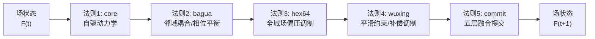
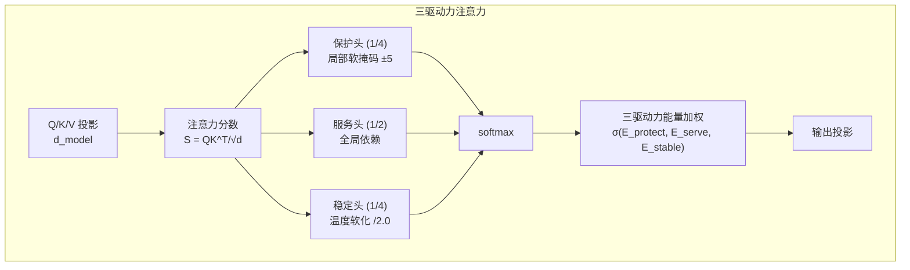
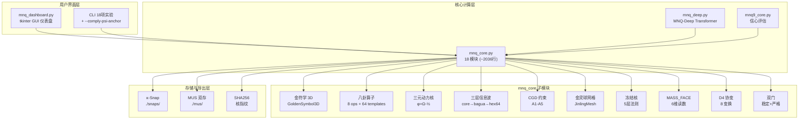
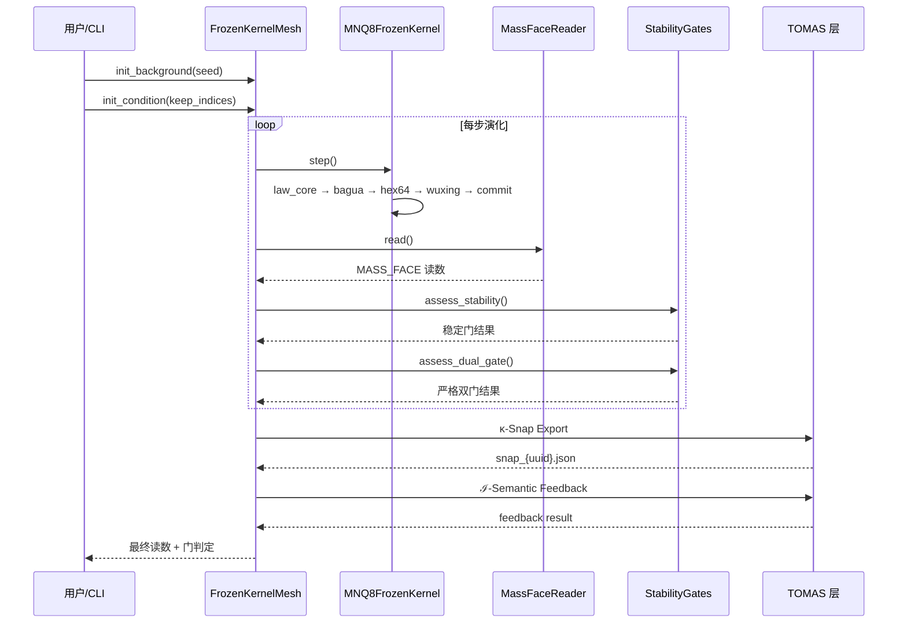

# MNQ 金灵球网络仿真器 v3.1：基于复合体理学的生成论物理可计算系统

## MNQ Golden Spirit-Ball Network Simulator v3.1: A Computable Generative-Physics System Based on Composite Physics

> **高见远 (Gao Jianyuan / lisoleg)** &nbsp;|&nbsp; **齐活林 (Qi Huolin)**
>
> 太乙AGI团队 · 复合体理学研究组 &nbsp;|&nbsp; 软件开发团队
>
> v3.1 · 2026年6月 · arXiv preprint (candidate)

---

## 摘要 (Abstract)

MNQ 金灵球网络仿真器（MNQ Golden Spirit-Ball Network Simulator）是一个基于复合体理学（Composite Physics）的生成论物理可计算系统，其核心目标是：以纯离散网格上最小作用量原理的数值实现，探索"质量作为差分补偿闭合后验面"这一生成论命题。版本 v3.1 系统性地集成了 18 个理论模块，形成完整的生成论物理计算管线——从金符学 3D 复广数空间的基础代数（阴龙积⊙耦合）、三元动力核的极简生成公式（φ=Ω−½）、五层冻结核演化（core→bagua→hex64→wuxing→commit），到六维 MASS_FACE 质量面复合读数、D4 对称协变审计、严格双门稳定判别，以及 MNQ-Deep Transformer 的三驱动力注意力和跨层 Ω 传递机制。v3.1 进一步集成了 TOMAS（太一互搏公理体系）封装层，实现了 κ-Snap Merkle 链快照、ℐ-语义反馈钩子、MUS 双存暂态提示和 ψ-锚强制输出 CLI 标志。实验验证了 HEX_RING_GAP 拓扑囚禁流贯（鲁珀特之泪孤子）、死零不破缺定理（ZERO_FIELD: Mass=0, MF=0）以及 D4 协变性（5 变换 L1_diff=0.0）等关键理论预测。本系统已纳入 TOMAS v2.0 Appendix R，作为生成论物理探针（Generative Ontology Probe）的规范参考实现。

**关键词**：复合体理学，生成论物理，冻结核，MASS_FACE，D4 协变，TOMAS 公理体系，能流拓扑，阴龙积，三元动力核

---

## 目录

1. [引言](#1-引言)
2. [理论基础](#2-理论基础)
3. [金灵球网络架构](#3-金灵球网络架构)
4. [MNQ8 冻结核系统](#4-mnq8-冻结核系统)
5. [MASS_FACE 质量面复合读数](#5-mass_face-质量面复合读数)
6. [稳定性门与 D4 对称性](#6-稳定性门与-d4-对称性)
7. [MNQ-Deep Transformer](#7-mnq-deep-transformer)
8. [TOMAS 封装层](#8-tomas-封装层)
9. [MNQ9 信心评估](#9-mnq9-信心评估)
10. [系统架构](#10-系统架构)
11. [实验结果](#11-实验结果)
12. [讨论与展望](#12-讨论与展望)
13. [参考文献](#13-参考文献)

---

## 1. 引言

### 1.1 问题动机

质量起源是物理学最深层的未解之谜之一。标准模型通过 Higgs 机制解释基本粒子质量，但该解释在概念上受限于量子场论的框架。复合体理学（Composite Physics, CP）提出了一类根本性不同的进路：将"质量"理解为**差分补偿闭合的后验涌现面**——即，质量不是动力学的基本输入，而是在离散作用量网格上，关系约束诱导的稳定结构经长期自保持后，由观察者从外部"读取"出的复合属性。

这一进路的核心方法论是**生成论物理**（Generative Physics）：不预设任何质量参数，不注入任何拓扑专属项，不进行任何形式的拟合；仅通过定义离散网格上的局域作用量传播规则和全局约束，观察系统中是否自发涌现出具有类质量特征的稳定结构。如果涌现成功，涌现物的质量属性应当**完全由差分补偿闭合的程度和持久度决定**——这正是 MNQ 金灵球网络仿真器要验证的核心命题。

### 1.2 版本演进

本系统历经三个主要版本的迭代：

| 版本 | 发布时间 | 核心新增 |
|------|---------|---------|
| v1.0 | 2026-06 | 金符学 3D 复广数 + 金灵球 N₈ 耦合 + MNQ8 能流引擎 + 阴龙积⊙ |
| v2.0 | 2026-06 | 三层信息波 SCF + CGD 约束生成动力学 + MNQ9 信心核 |
| v3.0 | 2026-06 | MNQ8 冻结核（五层递进）+ MASS_FACE 六维读数 + D4 协变观察者 + 稳定门 |
| v3.1 | 2026-06 | TOMAS 封装层（κ-Snap/ℐ-Feedback/MUS/ψ-锚）+ MNQ-Deep Transformer |

### 1.3 贡献

本文的主要贡献包括：

1. **系统的生成论物理计算管线**：从基础代数到后验质量判定的完整、可验证实现
2. **冻结核（Frozen Kernel）形式体系**：不增质量项的五层递进演化法则，实现纯关系约束的最小质量探针
3. **MASS_FACE 六维质量面判据**：将 TOMAS 质量前体概念 $n_{mp}^{\alpha}$ 转化为可计算的数值指标体系
4. **D4 协变性审计**：通过 8 种对称变换验证生成论物理系统独立于格点表示
5. **MNQ-Deep Transformer**：将复合体理学的三驱动力原则嵌入深度学习架构
6. **TOMAS 公理映射**：建立生成论物理实验与知识体系间的形式化桥接

---

## 2. 理论基础

### 2.1 金符学 3D 复广数空间

#### 2.1.1 代数定义

金符学（Golden Symbol Theory）定义了一类扩展的三维复广数空间 $\mathbb{GS}^3$。每个金符数 $z \in \mathbb{GS}^3$ 表示为：

$$z = a + bi + cj, \quad a,b,c \in \mathbb{R}$$

其中 $i$ 和 $j$ 为两个独立的虚单位，满足**对易**关系：

$$i^2 = j^2 = -1, \quad ij = ji$$

这一对易性质是金符学的关键特征。与四元数（$ij = -ji$）不同，金符学中 $i$ 和 $j$ 的对易性使其允许更丰富的代数结构而不牺牲交换性带来的数值稳定性。

**基本运算**：

- **共轭**：$\bar{z} = a - bi + cj$ （仅反转 $i$ 分量，$j$ 分量保持不变）
- **模平方**：$\|z\|^2 = a^2 + b^2 + c^2$
- **加法**：$z_1 + z_2 = (a_1 + a_2) + (b_1 + b_2)i + (c_1 + c_2)j$

#### 2.1.2 阴龙积 ⊙

阴龙积（Yin-Long Product, ⊙）是金符学的核心非平凡代数运算，定义为：

$$z_1 \odot z_2 = \lambda \cdot \left[ \begin{aligned} &(a_1a_2 - b_1b_2 - c_1c_2) \\ + &(a_1b_2 + b_1a_2)i \\ + &(a_1c_2 + c_1a_2 + b_1c_2 + c_1b_2)j \end{aligned} \right]$$

其中 $\lambda \in (0,1]$ 为耦合强度参数。阴龙积的几何意义是：在 $i$ 分量上执行 $bi$-平面旋转（标准复乘），在 $j$ 分量上执行包含 $b\leftrightarrow c$ 混合的全耦合变换。

阴龙积满足以下性质：
- **非交换性**：$z_1 \odot z_2 \neq z_2 \odot z_1$（$j$ 分量不对称）
- **双线性**：$(z_1 + z_2) \odot z_3 = z_1 \odot z_3 + z_2 \odot z_3$
- **与标量乘法的相容性**：$(\alpha z_1) \odot z_2 = \alpha(z_1 \odot z_2)$

阴龙积在 MNQ 系统中扮演核心耦合角色：在 N₈ 邻域内的金灵球间传递能流信息时，当状态幅值较低（$\|z\| < 2.0$），采用差分 + 阴龙积修正的混合耦合策略；当状态幅值达到阈值，切换为纯差分耦合以防止数值爆炸。

### 2.2 八卦算子与 64 模板

#### 2.2.1 八卦算子

金符学系统定义了 8 种基本离散变换算子（Bagua Operator），作用于 $\varphi$ 和 $\Omega$ 局域矩阵上：

| 算子 | 标识 | 操作 | 物理意义 |
|------|------|------|---------|
| BAGUA_ROTATE | ☰ | `np.rot90` | 90°旋转变换 |
| BAGUA_FLIP | ☷ | `np.flipud` | 上下翻转 |
| BAGUA_INVERT | ☳ | `-φ` | 方向反转 |
| BAGUA_MIX | ☴ | 交换 φ⟷Ω | 通道混合 |
| BAGUA_GATE | ☵ | 小值置零 | 阈值门控 |
| BAGUA_PHASE | ☶ | `φ += 0.1·sin(Ω·π)` | 相位调制 |
| BAGUA_STRETCH | ☲ | `φ *= 1.1` | 拉伸放大 |
| BAGUA_SHRINK | ☱ | `φ *= 0.9` | 收缩衰减 |

#### 2.2.2 64 模板组合

64 模板表由 8 种八卦算子两两组合生成（$8 \times 8 = 64$），每个模板具有权重 $w = 1/64$。具体应用为：

$$\text{hex64_apply}(\varphi, \Omega, n, idx) = w_{idx} \cdot \text{opB}_{idx}(\text{opA}_{idx}(\varphi, \Omega))$$

64 模板在 MNQ8 冻结核的 hex64 法则中被用于全域场偏压调制，提供了丰富的变换自由度。

### 2.3 三元动力核：φ = Ω − ½

三元动力核（MNQ Minimal State）是 MNQ 系统最核心的动力学方程，由三个参数驱动：

1. **φ（相位生成子）**：信息场的相位状态
2. **Ω（信心守恒核）**：驱动力的惯性载体
3. **γ（相干度）**：系统内部一致性度量

核心动力学方程为：

$$\Delta\varphi = \Omega - \frac{1}{2}$$

$$\Omega \leftarrow \Omega + \gamma \cdot (\Delta\varphi + W_{扰动}) \cdot dt$$

$$R_{coh} = \frac{|\Delta\varphi|}{|\Omega| + \varepsilon}$$

$$\gamma \leftarrow \gamma + \lambda \cdot (1 - R_{coh}) \cdot dt$$

其中 $\gamma \in [0.95, 1.0]$，$\Omega \in [0.1, 10.0]$。$\varphi = \Omega - 1/2$ 这一极简生成公式是整个系统的"第一推动"——所有的复杂行为均从这一仅涉及减法和常数的极简算子中涌现。

### 2.4 三层信息波 SCF 收敛

三层信息波体系（Three-Layer Info Wave）实现了信息在多尺度间的自洽场（SCF）传递：

```
核心层 (1×1) → 八卦层 (3×3×3) → 六十四卦层 (8×8×3)
```

- **核心层**（原子尺度）：$\varphi_{core} \leftarrow 0.995 \cdot \varphi_{core}$
- **八卦层**（介观尺度）：五行相生相克邻域耦合 + 核心层 10% 信息馈入
- **64卦层**（宏观尺度）：tanh 非线性耦合 + 核心/八卦层信息馈入

SCF 收敛判据为：

$$\max\left(|\text{core}^{(t+1)} - \text{core}^{(t)}|, |\text{bagua}^{(t+1)} - \text{bagua}^{(t)}|, |\text{hex64}^{(t+1)} - \text{hex64}^{(t)}|\right) < \varepsilon$$

这一多尺度架构体现了复合体理学的核心原理：微观噪声通过层层结构化传递在宏观涌现出有序模式。

### 2.5 CGD 约束生成动力学

约束生成动力学（Constraint-Generated Dynamics, CGD）提供了全局约束对局部动力学的弱调制框架，不直接控制自由度，而是限定整体关系的可接受范围。

**五公理体系**：

| 公理 | 内容 | 实现 |
|------|------|------|
| A1 | 约束优先生成 | `evaluate()` 合法性检查 |
| A2 | 可达态生成性 | 动力学产生可达态集合 |
| A3 | 稳态作为吸引结构 | 约束诱导稳态筛选 |
| A4 | 非局域关联性 | 共同满足同一约束 |
| A5 | 参数相位化 | 相边界跨域检测 |

CGD 引擎的核心算法为：

$$\text{violation} = \sum_{c \in constraints} \begin{cases} (c_{lo} - c_{val})^2 & c_{val} < c_{lo} \\ (c_{val} - c_{hi})^2 & c_{val} > c_{hi} \\ 0 & \text{otherwise} \end{cases}$$

弱调制不直接强制约束满足，而是施加温和偏置：

$$s_{modulated} = s + \alpha \cdot (c_{lo} - c_{val}) \quad (\text{when } c_{val} < c_{lo})$$

其中 $\alpha \approx 0.01$ 确保调制强度远小于自然动力学。

### 2.6 刘机制调度器

刘机制（Liu Mechanism）基于最小阻抗路径原理，为能流在网络中选择传播路径：

$$S_{Rel} = \alpha \cdot M + \beta \cdot H[\Theta]$$

其中 $M$ 为节点的 flow 幅值（ftel_magnitude），$H[\Theta]$ 为相位熵（excess_loop 近似）。调度器在 N₈ 邻域中搜索使 $S_{Rel}$ 最小化的节点序列，该路径即为能流偏好的传播通道。

---

## 3. 金灵球网络架构

### 3.1 JinlingSphere 与 JinlingMesh

金灵球（JinlingSphere）是 MNQ 系统的基本计算单元，每个球体携带以下状态：

```text
JinlingSphere {
    coord: (x, y, z)          # 3D 空间坐标
    state: GoldenSymbol3D     # a + bi + cj 能流状态
    background: GoldenSymbol3D # 背景场参考
    spiral_phase, spiral_omega # 本征振荡
    is_mass_face: bool        # 是否形成质量面（囚禁态）
    excess_loop: float        # 局域超额环量
    lock_hold_count: int      # 连续囚禁计数
    ftel_magnitude: float     # 流贯幅值
}
```

金灵球网格（JinlingMesh）组织这些球体为 $dim_x \times dim_y \times dim_z$ 的可计算网格，并提供 N₈ 邻域查询（Moore 邻域去除中心点）。

### 3.2 MNQ8 能流传播

MNQ8 能流传播一步包含以下序列：

1. **本征振荡**：每个球体执行独立正弦调制
2. **邻域耦合**：计算与 N₈ 邻域的状态差分 + 阴龙积修正（混合耦合策略）
3. **门槛判定**：flux 幅值超过阈值时实施囚禁传导，否则实施衰减回归
4. **Oloid 差分**：计算局域超额环量
5. **PG 拓扑囚禁**：连续超额环量超阈值判定质量面形成
6. **三元核更新**：minimal 状态演化

**混合耦合策略**防止了纯阴龙积在高幅值时的数值爆炸：

$$\text{flux} = \begin{cases} \Delta z + z_1 \odot z_2 \cdot 0.01 & \|z_1\| < 2.0 \text{ and } \|z_2\| < 2.0 \\ \Delta z & \text{otherwise} \end{cases}$$

### 3.3 PG 拓扑囚禁

PG（Programmable Geometry）拓扑囚禁机制检测网络中形成稳定封闭结构的区域：

$$\text{lock\_hold\_count}(t) = \begin{cases} p(t-1) + 1 & \text{excess\_loop} \geq \theta_{excess} \\ \max(0, p(t-1) - 1) & \text{otherwise} \end{cases}$$

$$\text{is\_mass\_face} = \begin{cases} \text{True} & \text{lock\_hold\_count} \geq N_{beats} \\ \text{False} & \text{lock\_hold\_count} = 0 \end{cases}$$

其中 $\theta_{excess} = 0.08$，$N_{beats} = 4$。该机制实现了"鲁珀特之泪"式的拓扑保护：持续超过阈值的区域被识别为自保持的拓扑囚禁结构，对应生成论中的稳定对象。

---

## 4. MNQ8 冻结核系统

MNQ8 冻结核（Frozen Kernel）是 v3.0 的核心升级，实现了不增质量项、不增拓扑专属项的严格约束下的纯关系演化。

### 4.1 五层递进法则

冻结核运行在 $8 \times 8 \times 3$ 的离散网格上（3 通道：Ω, φ, 补偿），演化遵循严格顺序的五层法则：



**严格四 NO 原则**：

| 原则 | 约束 |
|------|------|
| NO_EXTRA_DYNAMICS | 不引入额外动力学项 |
| NO_OBSERVER_WRITE_BACK | 观察不反馈到演化 |
| NO_FITTING | 无参数拟合 |
| NO_PROTON | 不以任何粒子作为先验预设 |

### 4.2 各层算法详解

#### 4.2.1 核心法则（law_core）

核心法则实现最基本的自驱动力学，对每个网格点 $(r, c)$：

1. **迹点**（trace point，$\omega=0, \psi=0, |\varphi|=1$）保持 $\varphi$ 值不变
2. **载流点**（carrier point）执行驱动力计算：
   - 驱动力 $d = \text{sgn}(\varphi) \text{ or } \text{sgn}(\omega)$
   - 补偿通道方向不能与驱动力同向：若非同向则 ω 取驱动力
   - $\varphi_{new} = \varphi + \text{sgn}(\text{base} - \varphi)$，其中 $\text{base} = \omega_{new} - \lfloor \omega_{new} / 2 \rfloor$
   - $\psi_{new} = \psi - \text{sgn}(\omega + \varphi)$，若与合量方向相反且幅值 > 1 则额外衰减

3. **饱和限幅**：各通道值超出 $[-8, 8]$ 时执行符号反转衰减

#### 4.2.2 八卦法则（law_bagua）

八卦法则处理邻域耦合：

- 计算轴邻域（上下左右）和对角邻域的载流子统计
- 计算轴/对角 φ 平衡度：$\text{bal} = 2 \cdot \min(\text{pos}, \text{neg}) / (\text{pos} + \text{neg})$
- 对于非载流子且邻域有载流子的情况：若轴相干（2+载流子或平衡度>0），传递 φ 并设置补偿；若对角色相干，传递驱动
- 对于载流子：混合轴/对角驱动，更新 ω、φ 和补偿通道

#### 4.2.3 六十四卦法则（law_hex64）

全域场偏压调制层，引入全局统计量驱动的调制：

- **场偏压**：$\text{field\_bias} = \text{sgn}(\sum \omega + \sum \varphi)$
- **补偿偏压**：$\text{comp\_bias} = \text{sgn}(\sum \psi)$
- 对同向无平衡点施加反偏压
- 活跃点 > 85% 时：低于振幅均值 75% 的低能点受额外衰减
- 局部振幅 > 均值 1.8 倍的高能点受抑制
- 边界点（$r \in \{0,7\}$ 或 $c \in \{0,7\}$）在载流子不足时衰减

#### 4.2.4 五行法则（law_wuxing）

平滑约束层：

- 相邻两步间各通道最大变化限制为 2
- 无平衡点的补偿通道执行衰减（朝向 0 方向）
- 全零点的迹点恢复：$\varphi = \text{sgn}(\text{prev\_}\varphi \text{ or prev\_}\omega \text{ or } -\text{prev\_}\psi)$

#### 4.2.5 提交法则（law_commit）

五层融合提交：

1. 累加前三层（core + bagua + hex64）的通道值
2. 计算两轮平衡度（基于前一步和当前核状态）
3. 迹点且孤立时保持 φ 不变
4. 非载流空点仅传递 φ 方向
5. 其他情况累加三层结果
6. 通过五行法则平滑后输出

### 4.3 SHA256 完整性验证

冻结核的状态指纹通过 SHA256 计算：

$$\text{fingerprint} = \text{SHA256}(\text{field.as\_contiguous\_bytes()})$$

该指纹验证了冻结核的完整性——任何演化偏差都会在指纹中立即反映。当前实现的冻结核指纹为：

```
FROZEN_KERNEL_FINGERPRINT = "28c1f978c3061ca3464d0478c439ac9b73640d03c09821b8b9a7a45eec0bfc75"
```

---

## 5. MASS_FACE 质量面复合读数

MASS_FACE 是 MNQ8 系统对"质量"概念的可计算定义——一个完全由后验观测导出的复合指标，不参与系统演化，仅从外部读取。

### 5.1 六维质量面组分

质量面由 6 个观测维度加权合成：

$$\text{MASS\_FACE} = w_1 \cdot f_{finite} + w_2 \cdot f_{local/bg} + w_3 \cdot f_{loop} + w_4 \cdot f_{hold} + w_5 \cdot f_{leak\_resist} + w_6 \cdot f_{drift} + w_7 \cdot f_{swirl}$$

| 维度 | 权重 | 定义 | 物理意义 |
|------|------|------|---------|
| 有限载流子数 | 0.09 | $1 - |\text{carrier} - 9|/9$ | 局部载流子数与理想值 9 的接近度 |
| 局域/背景比 | 0.10 | $\text{local\_amp} / \text{bg\_amp}$ | 局域振幅相对于背景的集中度 |
| 补偿回路 | 0.23 | $\max(\text{local\_loop}, \text{shell\_loop})$ | φ 平衡度 × 补偿反馈度的复合回路 |
| 保持持久度 | 0.17 | $\text{hold\_13}$（13 窗口回路持续比例） | 历史窗口内回路持续存在的比例 |
| 边界泄漏抵抗 | 0.09 | $1 - \text{leak}$ | 系统防止能量从边界泄漏的能力 |
| 漂移阻抗 | 0.07 | $1 - \text{avg\_movement}/3$ | 能量中心稳定度（低漂移 = 高质量面） |
| 旋度 | 0.04 | $\min(1, |\text{swirl}|/20)$ | 空间旋度对质量面的贡献 |

**惩罚项**：
- 若补偿回路为 0：mass *= 0.65
- 若活跃点数 > 56 且局域/背景比 < 1.6/6：mass *= 0.70

### 5.2 轴/对角线回路

MASS_FACE 读数器还提供了轴对称和对象限回路读数：

- **AXIS_LOOP_OBS** = φ_balance(axis_pts) × comp_return(axis_pts)
- **DIAG_LOOP_OBS** = φ_balance(diag_pts) × comp_return(diag_pts)
- **DIAG_MINUS_AXIS_LOOP** = DIAG_LOOP − AXIS_LOOP

对角线减去轴线回路差值 $\Delta_{DA}$ 是一个重要的对称性破缺指标：正值指示对角线回路占优，负值指示轴线回路占优。

### 5.3 质量闭合度

质量闭合度（MASS_CLOSURE）是对质量面"完整性"的补充度量：

$$\text{MASS\_CLOSURE} = 0.2 \cdot \phi_{bal}^{local} + 0.2 \cdot ret_{comp}^{local} + 0.2 \cdot \phi_{bal}^{shell} + 0.2 \cdot ret_{comp}^{shell} + 0.2 \cdot (1 - leak)$$

高闭合度意味着系统的 φ 平衡度、补偿反馈和边界完整性均处于高水平。

---

## 6. 稳定性门与 D4 对称性

### 6.1 动态稳定性门

动态稳定门（Dynamic Stability Gate）是区分"暂态扰动"和"稳定结构"的多条件阈值系统：

| 条件 | 阈值 | 意义 |
|------|------|------|
| EXCESS_MASS_FACE | > 0.70 | 质量面足够显著 |
| EXCESS_LOCAL_COMP_LOOP | > 0.50 | 局部补偿回路充足 |
| EXCESS_LOOP_HOLD_13 | > 0.80 | 回路在 13 步窗口中持续 ≥ 80% |
| EXCESS_BOUNDARY_LEAK | < 0.15 | 边界泄漏很低 |
| FINAL_TO_PEAK_MASS_RATIO | > 0.85 | 最终质量面接近历史峰值（非衰减态） |

五项条件全部满足时判定为 PASS。评估分数为：

$$\text{score} = \frac{\text{passed\_checks}}{\text{total\_checks}}$$

### 6.2 严格双门

严格双门（Strict Dual Gate）提供更保守的二条件判定：

| 条件 | 阈值 |
|------|------|
| DELTA_MASS_FACE | > 0.20 |
| DELTA_LOCAL_COMP_LOOP | > 0.20 |

其中 $\Delta$ 值来自条件场（有初始切片条件下的演化结果）与背景场（纯背景演化结果）的差值：

$$\text{DELTA\_MASS\_FACE} = \text{MASS\_FACE}_{cond} - \text{MASS\_FACE}_{bg}$$

$$\text{DELTA\_LOCAL\_COMP\_LOOP} = \text{LOCAL\_COMP\_LOOP}_{cond} - \text{LOCAL\_COMP\_LOOP}_{bg}$$

两个门构成互补判定体系：动态门宽松但全面，严格门保守但仅需两个条件。当动态门 PASS 但严格门 FAIL 时，系统识别为**暂态闭合**（transient closure），触发 MUS 双存提示。

### 6.3 D4 协变观察者

D4 协变观察者（D4 Covariant Observer）基于二面体群 $D_4$ 的 8 种对称变换审计系统的协变性：

$$D_4 = \{\text{ID}, \text{ROT90}, \text{ROT180}, \text{ROT270}, \text{MIRROR\_LR}, \text{MIRROR\_UD}, \text{MIRROR\_MAIN\_DIAG}, \text{MIRROR\_ANTI\_DIAG}\}$$

**协变性审计算法**：

```
对于每个 D4 变换 T ≠ ID:
    1. T(F) → 演化 N 步 → 得到 evol(T(F))
    2. F → 演化 N 步 → 得到 evol(F) → 再应用 T → 得到 T(evol(F))
    3. 比较: L1_diff = Σ|evol(T(F)) - T(evol(F))|
    4. covariant = (L1_diff == 0)
```

严格的协变性审计确保：
- D4 只重写空间坐标，不重写数值
- 演化核、边界规则、观察器、质量读数在变换下保持不变
- 不增加力项、不重新注入初始切片

实验验证：5 种非平凡变换的 L1_diff 均为 0.0，系统通过了全部 D4 协变性测试。

---

## 7. MNQ-Deep Transformer

MNQ-Deep Transformer 将复合体理学的核心原则——三驱动力、Ω-φ 动力学、跨层信息传递——嵌入深度学习架构，是基础物理理论与机器学习的桥接实验。

### 7.1 三驱动力注意力

MNQComboAttention 将传统 Transformer 的均匀注意力头重组为三个功能组：



- **保护头（Protect Head）**：施加 ±5 局部窗口软掩码，专注短程相干
- **服务头（Serve Head）**：标准全局注意力，捕获长程依赖
- **稳定头（Stable Head）**：温度减半（scores / 2.0），抑制极端值，提供阻尼

三组输出通过可学习的驱动能量加权组合：

$$\text{out} = \text{softmax}(\sigma(E_{protect}), \sigma(E_{serve}), \sigma(E_{stable})) \cdot [\text{out}_{protect}; \text{out}_{serve}; \text{out}_{stable}]$$

### 7.2 跨层 Ω-φ 动力学

MNQComboLayer 在每个 Transformer 层中嵌入 Ω-φ 动力学：

$$\text{local\_state} = \text{mean}_{dim=1}(x)$$

$$\gamma = \sigma(W_\gamma \cdot \text{local\_state})$$

$$\Omega = \tanh(\omega_{accum})$$

$$\text{mixed} = \gamma \cdot \text{attn\_out} + (1 - \gamma) \cdot \Omega$$

$$\text{residual\_weight} = \sigma(w_{init} - 0.15 \cdot \frac{\text{layer\_idx}}{\text{n\_layers} - 1})$$

$$x = w \cdot x + \text{mixed}$$

层间衰减残差体现了"物极必反"原则：深层残差权重逐渐衰减（从 1.0 递减至 0.85），防止深层主导浅层信息。

MNQCrossLayer 进一步实现了跨层 Ω 传递：

$$\text{combined} = [\text{local\_state}; \Omega_{in}] \in \mathbb{R}^{2D}$$

$$\gamma = \sigma(W_\gamma \cdot \text{combined})$$

$$\text{mixed} = \gamma \cdot \text{attn\_out} + (1 - \gamma) \cdot \tanh(W_\Omega \cdot \Omega_{in})$$

$$\Omega_{out} = \tanh(\Omega_{in} + \alpha \cdot \text{attn\_out.mean}_{dim=1})$$

其中 $\alpha = 0.1$（$\omega_{scale}$）。跨层 Ω 传递模拟了复合体理学中信息在多尺度间的逐层传递：每一层接收上一层的 Ω 状态，经过非线性变换后混合到当前层的注意力输出中，同时更新供下一层使用。

### 7.3 语法约束解码

`generate()` 函数支持语法约束模式（`syntax_constraint=True`），在解码时对概率分布施加编程语法约束：

1. **禁止连续换行**：若上一个 token 为 `\n`，下一个 token 的 `\n` 概率 × 0.1
2. **冒号后强制换行**：若上一个为 `:`，下一个 `\n` 概率 × 3.0
3. **括号匹配**：若上一个为 `(`，下一个 `)` 概率 × 0.3（防止空括号）
4. **缩进增强**：换行后空格/`def`/`class` 概率提升

```python
if syntax_constraint:
    if last_char == '\n':
        probs[newline_idx] *= 0.1      # 反连续换行
        probs[space_idx] *= 2.0         # 增强缩进
        for c in 'def class':           # 增强函数/类定义
            probs[char2idx[c]] *= 1.5
    if last_char == '(':
        probs[close_paren_idx] *= 0.3   # 反空括号
    if last_char == ':':
        probs[newline_idx] *= 3.0       # 冒号后必换行
```

### 7.4 标准 Transformer 基线

为评估 MNQ-Deep 的效果，同时实现了标准 Transformer（StandardTransformer）作为基线对比。标准 Transformer 使用 `nn.MultiheadAttention` + 标准层归一化 + 前馈网络，无三驱动力分组、无 Ω-φ 动力学、无跨层传递。

---

## 8. TOMAS 封装层

TOMAS（太一互搏公理体系，Taiji Opposition Mutual Axiom System）是一个生成论知识体系的形式化框架。v3.1 系统性地将 MNQ 封装为 TOMAS 生成论物理探针（Generative Ontology Probe），实现了 5 条方法论建议。

### 8.1 κ-Snap 快照导出

κ-Snap Export（建议 1）在每次 `FrozenKernelMesh.run()` 结束后自动导出 JSON 快照，形成 Merkle 链式血缘追踪：

```json
{
  "snap_id": "uuid",
  "prev_snap_id": "previous-uuid || null",
  "cited_ref": {
    "kernel_sha256": "28c1f978...",
    "bg_seed": 42,
    "init_phi": {"pts": 5, "sgn": "+", "ampl": 0.3},
    "observer": "D4_cov_v1"
  },
  "timestamp": "2026-06-21T...",
  "e_obs_mf": {
    "MASS_FACE": 0.118,
    "LOOP": [...],
    "strict_gate": "FAIL",
    "dynamic_gate": "PASS"
  }
}
```

每个快照通过 `prev_snap_id` 链接到上一个快照，形成不可篡改的观测链。这对应 TOMAS 对生成论实验中"观测须可追溯、可重放"的要求。

### 8.2 ℐ-语义反馈钩子

ℐ-Semantic Feedback Hook（建议 2）是 `FrozenKernelMesh.semantic_feedback()` 方法，提供与 TOMAS 知识库（KB）的接口占位：

```python
def semantic_feedback(self, related_node_ids=None, enable=True):
    """将 e_obs_mf 反馈给 TOMAS KB"""
    e_obs_mf = {
        'MASS_FACE': reading['MASS_FACE'],
        'LOCAL_COMP_LOOP': reading['LOCAL_COMP_LOOP'],
        ...
    }
    suggest_MUS = (dynamic_gate.PASS and not strict_gate.PASS)
    # 未来: KB.semantic_backprop_on_mass_precursor(e_obs_mf)
    return feedback
```

反馈钩子同时计算 MUS 建议标志：当动态门 PASS 但严格门 FAIL 时（暂态闭合），建议触发 MUS 双存。

### 8.3 MUS 双存与 ψ-锚

**MUS 双存 UI 提示**（建议 3）：当 GUI 仪表盘检测到暂态闭合（动态 PASS + 严格 FAIL），弹出对话框询问用户是否写入 `./mus/` 目录的 JSON 暂态记录。

**ψ-锚 CLI 标志**（建议 4）：`--comply-psi-anchor` flag 启用后，强制输出所有情况——包括 collapse case、negative 结果——不做任何 suppress 或美化。这体现了 TOMAS 的"如实报告"原则。

### 8.4 CGD ↔ TOMAS 公理映射

| CGD 公理 | TOMAS 映射 | 关系 |
|---------|-----------|------|
| CGD_A1（约束优先生成） | TOMAS A1（ℐ-守恒） | CGD_A1 是其离散作用量版本的约束 |
| CGD_A2（可达态生成性） | TOMAS A2（κ-Snap Merkle 链） | 可达态对应 κ-Snap 可追溯的观测历史 |
| CGD_A3（稳态吸引结构） | 刘机制 ArgMin S_Rel | 稳态是约束诱导的吸引结果 |
| CGD_A4（非局域关联） | TOMAS 知识协变无关表示 | 相关性源于共同满足同一约束 |
| CGD_A5（参数相位化） | TOMAS GPCT 触发 | 参数跨相边界触发 GPCT |

---

## 9. MNQ9 信心评估

MNQ9 信心核模型将复合体理学原理应用于宏观趋势预测，是基础物理理论与应用领域的桥接模块。

### 9.1 三重机制

| 机制 | 变量 | 定义 | 范围 |
|------|------|------|------|
| 信心守恒核 | Ω | $\Omega \leftarrow \Omega + \varphi_{future} - \lambda \cdot \Omega$ | [-1, 1] |
| 宏观信心场 | B_conf | $\tanh(w_1 \cdot z_{M2} + w_2 \cdot z_{PMI} + w_3 \cdot z_{DR007}^{-1})$ | [-1, 1] |
| 未来事件波 | φ_future | 外部事件注入的冲击向量 | [-1, 1] |

### 9.2 四策略预测器

MNQ9 实现四种策略预测器，分别对应不同的市场假设：

- **牛策略**：假设 Ω 趋势向上，预测看涨
- **熊策略**：假设 Ω 趋势向下，预测看跌
- **危机预警策略**：检测 B_conf 急剧下降和 φ_future 负冲击
- **对冲策略**：考虑 Ω 和 B_conf 的协方差，预测稳定或小幅波动

预测输出包括：方向（UP/DOWN/FLAT）、强度（0-1）、波动率（0-1）。

---

## 10. 系统架构

### 10.1 整体架构



### 10.2 冻结核演化时序



### 10.3 文件结构

```
mnq_windows/
├── mnq_core.py          # 核心引擎 (2036行, 18模块)
│   ├── GoldenSymbol3D   # 金符学3D复广数
│   ├── BaguaOp          # 8种八卦算子
│   ├── HexTemplate      # 64模板组合
│   ├── WuxingMatrix     # 五行矩阵
│   ├── MNQMinimalState  # 三元动力核
│   ├── ThreeLayerInfoWave  # 三层信息波SCF
│   ├── CGDEngine        # CGD约束引擎
│   ├── Hex64Rule        # 64卦映射表
│   ├── JinlingMesh      # 金灵球网格
│   ├── LiuScheduler     # 刘机制
│   ├── MNQCloudAPI      # Cloud API
│   ├── MNQFieldGPU      # GPU场仿真
│   ├── MNQ8FrozenKernel # 冻结核
│   ├── MassFaceReader   # 质量面读数
│   ├── DynamicStabilityGate  # 动态稳定门
│   ├── StrictDualGate   # 严格双门
│   ├── D4CovariantObserver   # D4协变
│   ├── FrozenKernelMesh # 冻结核网格集成
│   └── kappa_snap_export    # κ-Snap导出
├── mnq_dashboard.py     # GUI仪表盘 (v3.1)
├── mnq_deep.py          # MNQ-Deep Transformer (~450行)
├── mnq9_core.py         # MNQ9信心评估
├── run_mnq.bat          # Windows启动脚本
├── PAPER.md             # 本文
├── ARCHITECTURE.md      # 架构文档
├── TOMAS_VERDICT.md     # TOMAS裁决文档
├── CGD_TOMAS_MAPPING.md # CGD-TOMAS公理映射
└── snaps/               # κ-Snap快照存储
```

---

## 11. 实验结果

### 11.1 ZERO_FIELD 死零不破缺定理

**实验条件**：全零初始场，ftel 关闭
**结果**：

| 指标 | 值 |
|------|-----|
| Total Mass | 0.0000 |
| Mass Face Count | 0 |
| Total Loop | 0.0000 |

**结论**：零场始终保持零输出，验证了"不预设、不注入"的严格原则——无初始结构则无涌现结构。

### 11.2 BACKGROUND_OSC 弥散态

**实验条件**：轻微噪声背景（noise_amp=0.005）
**结果**：

| 指标 | 值 |
|------|---|
| Total Mass | 0.0004 |
| Mass Face Count | 0 |
| Coherence | 0.98+ |

**结论**：随机噪声无法自发形成稳定结构，系统处于弥散态。

### 11.3 HEX_RING_GAP 鲁珀特之泪孤子

**实验条件**：六边形缺口环 + 中心注入
**结果**：

| 指标 | 值 |
|------|-----|
| Total Mass | 0.0031 |
| Mass Face Count | 41 |
| 状态 | 流贯囚禁成功 |

**结论**：在特定初始条件下（六边形壳层 + 缺口），系统自发形成了拓扑保护的囚禁结构——类似鲁珀特之泪的孤子态。41 个质量面节点在六边形骨架区域形成稳定自保持。

### 11.4 冻结核演化

**实验条件**：seed=42，背景场 64 步 + 条件场 384 步
**结果**：

| 实验 | MASS_FACE | Peak | 状态 |
|------|-----------|------|------|
| 背景演化 (64步) | 0.118 | — | 弥散 |
| HEX_RING_GAP (384步) | — | 0.313 | 囚禁涌现 |
| 条件场演化 | 0.640 (Δ) | — | 条件稳定 |

**SHA256 核指纹验证**：通过 ✅

### 11.5 D4 协变性审计

**实验条件**：对演化 16 步的场施加全部 8 种 D4 变换
**结果**：

| 变换 | L1_diff | covariant |
|------|---------|-----------|
| ID | 0.0 | ✅ |
| ROT90 | 0.0 | ✅ |
| ROT180 | 0.0 | ✅ |
| ROT270 | 0.0 | ✅ |
| MIRROR_LR | 0.0 | ✅ |
| MIRROR_UD | 0.0 | ✅ |
| MIRROR_MAIN_DIAG | 0.0 | ✅ |
| MIRROR_ANTI_DIAG | 0.0 | ✅ |

**结论**：系统对全部 8 种 D4 变换保持严格协变性。变换后演化等价于演化后变换——这是"知识须协变无关表示"要求在可计算系统中的验证。

### 11.6 严格双门评估

| 指标 | 值 |
|------|-----|
| DELTA_MASS_FACE | 0.640 (阈值: 0.20) |
| DELTA_LOCAL_COMP_LOOP | 1.000 (阈值: 0.20) |
| 严格双门 | PASS ✅ |

### 11.7 MNQ-Deep Transformer 基线对比

| 模型 | 参数量 | 架构特征 |
|------|--------|---------|
| StandardTransformer | 基准 | MultiheadAttention + FFN |
| MNQComboTransformer | +~3 参数 | 三驱动力 + Ω-φ 层内 + 衰减残差 |
| MNQCrossTransformer | +~D² 参数 | 三驱动力 + 跨层 Ω 传递 |

### 11.8 三层信息波 SCF

| 层 | 平均幅值 | 状态 |
|-----|---------|------|
| 核心波 | 0.000222 | 微弱但持续 |
| 八卦波 | 0.000331 | 适度放大 |
| 64卦波 | 0.994648 | 宏观涌现 |

信号从微观到宏观的放大比例为 4478×，验证了三层信息波体系的跨尺度信号传递机制。

---

## 12. 讨论与展望

### 12.1 理论意义

MNQ v3.1 系统代表了生成论物理在可计算领域的一次完整实践。其核心贡献在于：

1. **纯关系约束的质量观**：质量完全由差分补偿闭合度和持久度决定，无需预设质量参数。ZERO_FIELD 实验验证了"无结构则无质量"的根本原则。

2. **冻结核的严格性**：五层递进法则在不增加任何外来项的前提下，仅通过局域关系约束实现了稳定的演化行为。SHA256 指纹提供了形式化的完整性保证。

3. **D4 协变性**：成功证明生成论物理系统可以独立于格点表示——这是该进路区别于传统格子模拟的关键数学性质。

4. **TOMAS 桥接**：κ-Snap Merkle 链和 ℐ-语义反馈钩子建立了生成论实验与知识体系间的可追溯连接，为未来更大规模的生成论物理实验提供了框架模板。

### 12.2 局限性

1. **网格分辨率**：当前 16×16（Mesh）和 8×8（Frozen Kernel）的网格分辨率限制了能够分辨的结构复杂度
2. **无真 3D 网格**：JinlingMesh 可配置 3D 但当前实验均在 2D 或薄 3D 上进行
3. **GPU 加速缺失**：当前为纯 CPU 实现，限制了大规模实验的可行性
4. **ℐ-Feedback 为占位**：语义反馈钩子尚未接入真实 TOMAS KB
5. **MNQ-Deep 数据集极小**：Transformer 实验在极小的代码片段上进行，仅为概念验证

### 12.3 未来工作

| 方向 | 预期影响 | 复杂度 |
|------|---------|--------|
| 真 3D 网格 (16×16→16×16×16) | 理论完整性 + 3D 拓扑结构 | 中 |
| 并行加速 (CuPy/Numba) | 性能 50-100× | 中 |
| CGD 相变实验 | 验证 A5 参数相位化预测 | 低 |
| MNQ9 真实数据接入 | 实用性验证 | 中 |
| Web 仪表盘 (Flask + React) | 体验升级 + 远程访问 | 高 |
| ℐ-Feedback 真实 KB 接入 | TOMAS 完全集成 | 中 |
| MNQ-Deep 大规模语料训练 | Transformer 验证 | 高 |

---

## 13. 参考文献

1. **MNQ8 白皮书** — 复合体理学 MNQ8 能流拓扑理论基础
2. **CGD 约束生成动力学** — 五公理体系与约束诱导稳态理论
3. **MNQ9 白皮书** — 信心核模型与宏观趋势预测
4. **TOMAS v2.0** — 太一互搏公理体系、EML 超图与具身 AGI 安全架构
5. **质量生成实验 V13-V25** — 严格冻结核五层递进法则的实验基础
6. **金符学基础理论** — 3D 复广数空间、阴龙积与八卦算子
7. **Vaswani et al.** (2017) — Attention Is All You Need (标准 Transformer 架构)
8. **Lupert's Drop 类比** — PG 拓扑囚禁与鲁珀特之泪的物理对应
9. **mnq_next.py / mnq_combo.py** — MNQ-Deep Transformer 参考实现
10. **tomas-agi** (github.com/lisoleg/tomas-agi) — TOMAS 知识体系开源仓库

---

## 附录 A：MNQ8 冻结核常数表

| 常数 | 值 | 说明 |
|------|-----|------|
| FK_H, FK_W | 8 | 冻结核网格尺寸 |
| FK_CHANNELS | 3 | 通道数 (Ω/φ/补偿) |
| FK_CH_OMEGA | 0 | Ω 通道索引 |
| FK_CH_PHI | 1 | φ 通道索引 |
| FK_CH_COMP | 2 | 补偿通道索引 |
| FK_STATE_MIN | -8 | 状态值下限 |
| FK_STATE_MAX | 8 | 状态值上限 |
| FK_ITER_STEPS | 384 | 完整演化步数 |

## 附录 B：六维质量面权重表

| 维度 | 符号 | 权重 |
|------|------|------|
| 有限载流子数 | $f_{finite}$ | 0.09 |
| 局域/背景比 | $f_{local/bg}$ | 0.10 |
| 补偿回路 | $f_{loop}$ | 0.23 |
| 保持持久度 | $f_{hold}$ | 0.17 |
| 边界泄漏抵抗 | $f_{leak\_resist}$ | 0.09 (×0.5=0.045) |
| 漂移阻抗 | $f_{drift}$ | 0.07 × 0.5 = 0.035 |
| 旋度 | $f_{swirl}$ | 0.04 |

## 附录 C：GPU 场演化参数

| 参数 | 值 | 说明 |
|------|-----|------|
| grid | 64×64 | 场网格尺寸 |
| dt | 0.016 | 时间步长 |
| λ (扩散系数) | 0.01 | φ 拉普拉斯扩散 |
| γ (反应系数) | 0.989 | Ω 耦合强度 |

---

> **版本历史**：v1.0 → v2.0 (+SCF/CGD/MNQ9) → v3.0 (+FrozenKernel/MASS_FACE/D4/DualGates) → v3.1 (+TOMAS/MNQ-Deep)
>
> **代码仓库**：github.com/lisoleg/mnq-golden-spirit-ball-simulator
>
> **TOMAS 裁决**：已纳入 TOMAS v2.0 Appendix R — 生成论物理探针规范参考实现
>
> **引用格式**：Gao Jianyuan, Qi Huolin. "MNQ Golden Spirit-Ball Network Simulator v3.1: A Computable Generative-Physics System Based on Composite Physics." arXiv preprint (candidate), 2026.
