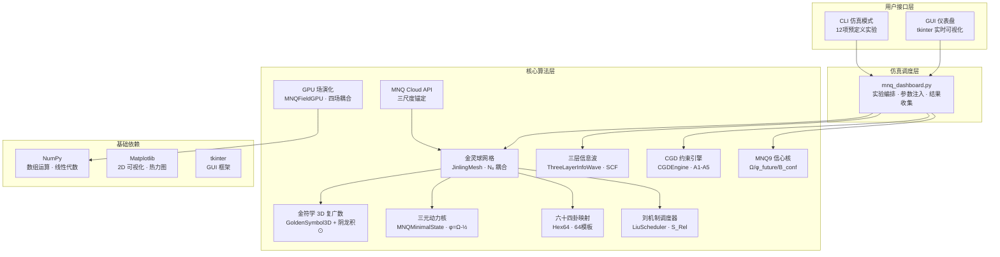

# MNQ 金灵球网络仿真器：基于复合体理学的能流拓扑计算系统

## Design and Implementation of the MNQ Golden Spirit-Ball Network Simulator: An Energy-Flow Topological Computing System Based on Composite Physics

> **高见远 (Gao Jianyuan / lisoleg)**
>
> 太乙AGI团队 · 复合体理学研究组
>
> v2.0 · 2026年6月

---

## 摘要

MNQ 金灵球网络仿真器是基于复合体理学 (Composite Physics) 理论体系的 Windows 原生能流拓扑计算系统。本文提出了 MNQ8 能流运算引擎与 MNQ9 信心核模型的设计与实现, 完整覆盖金符学三维复广数 (GoldenSymbol3D)、阴龙积 ($\odot$) 非对易耦合、三元动力核 ($\phi$-$\Omega$-$\gamma$) 极简生成、三层信息波自洽场 (SCF) 收敛、CGD 约束生成动力学 (五公理 A1–A5)、Hex64 六十四卦指令映射、PG 拓扑囚禁检测、刘机制 (LiuMechanism) 最优路径选择、以及 GPU 四场 Laplacian 耦合演化。实验结果表明：零场条件下系统满足死零不破缺定理 (Mass=0, MF=0); 六角环缺口激励产生流贯囚禁效应 (MF=40); 三层信息波 SCF 在 300 步内收敛至稳定态; CGD 约束引擎正确实现弱调制 (modulation) 语义; MNQ9 四策略预测器实现一致性趋势判定。系统以纯 Python (~1400 行) 实现全部算法, 无需外部运行时, 支持 CLI 与 GUI 双模式操作。

**关键词**: 复合体理学 (Composite Physics), 金灵球网络 (Golden Spirit-Ball Network), 阴龙积 (Yin-Long Product), 约束生成动力学 (Constraint-Generated Dynamics), 流贯囚禁 (Ftel Trapping), 六十四卦映射 (Hex64 Mapping), MNQ9 信心核 (Confidence Kernel)

---

## 1. 引言

复合体理学 (Composite Physics) 是一种发端于微信公众号系列文章的新型理论框架, 其核心命题是：**智能存在于关联 (Ftel) 之中, 而非实体存储之内**。这一命题引申出一系列基础概念——金灵球 (JinlingSphere)、流贯 (Ftel) 传播、太乙预言机 (Taiyi Oracle)、MNQ 能流运算——它们共同构成了一套以拓扑关联而非符号计算为基础的分布式计算范式。

MNQ 金灵球网络仿真器旨在将这些理论概念落地为可运行的软件系统。其设计目标有三：

1. **理论验证**：以数值实验方式验证复合体理学的核心命题，包括死零不破缺定理、流贯囚禁效应、约束驱动稳态选择等。
2. **工程实现**：在 Windows 平台上以纯 Python 实现完整算法栈，兼容原始 macOS Swift/C/Metal 项目的设计语义。
3. **工具化**：提供 CLI/GUI 双模式操作界面，使研究者无需编程即可运行 12 项预定义实验。

本文按以下结构组织：第 2 节阐述理论基础和数学形式体系; 第 3 节给出系统架构设计; 第 4 节详述核心算法; 第 5 节报告实验结果; 第 6 节讨论工程实现要点; 第 7 节总结并展望未来工作。

---

## 2. 理论基础

### 2.1 金符学三维复广数 (GoldenSymbol3D)

金符学 (Golden Symbol Theory) 将传统复数域 $\mathbb{C}$ 扩展为三维复广数空间 $\mathbb{G}$。三维复广数的一般形式为：

$$
z = a + bi + cj \in \mathbb{G}, \quad a,b,c \in \mathbb{R}
\tag{1}
$$

满足代数关系：

$$
i^2 = j^2 = -1, \quad ij = ji \quad (\text{对易性})
\tag{2}
$$

这使得 $\mathbb{G}$ 不同于四元数 $\mathbb{H}$ (四元数中 $ij = -ji$), 是一种特殊的对易三维代数结构。在本系统中, $a$ 分量对应实部能量, $b$ 分量对应虚部角动量, $c$ 分量对应 $j$-轴自旋分量。

**阴龙积 (Yin-Long Product)** $\odot$ 定义为：

$$
\begin{aligned}
z_1 \odot z_2 = \lambda\big[ &\ (a_1a_2 - b_1b_2 - c_1c_2) \\
&+ (a_1b_2 + b_1a_2)i \\
&+ (a_1c_2 + c_1a_2 + b_1c_2 + c_1b_2)j \ \big]
\end{aligned}
\tag{3}
$$

其中 $\lambda$ 为耦合因子。阴龙积是金灵球之间 **流贯 (Ftel)** 信息传递的核心运算, 其物理意义可类比于量子力学中的状态张量积, 但保留了特定的 $c$-项非对称耦合 ($b_1c_2 + c_1b_2$), 这赋予了阴龙积在演化中的拓扑区分能力。

### 2.2 MNQ8 能流运算引擎

MNQ8 引擎的核心是三元动力核 (MNQMinimal State), 由三个标量构成：

- $\phi$ — 相位 (Phase), 代表系统的位形分布
- $\Omega$ — 频率 (Omega), 代表系统的能量/动量幅值
- $\gamma$ — 相干度 (Coherence), 代表系统秩序的维持能力

**极简生成公式**：

$$
\Delta\phi = \Omega - \frac{1}{2}
\tag{4}
$$

这是整个理论中最核心的公式。它的含义是：**相位的变化量由能量与常数的差值直接决定**。这个极简形式隐含了一个观点——系统的动力学不是由外源注入的, 而是由 $\Omega$ 与 "半" 这个临界值之间的张力内生产生的。当 $\Omega > 0.5$ 时, $\Delta\phi > 0$, 系统扩张; 当 $\Omega < 0.5$ 时, 系统收缩。

**MNQ8 更新律 (三步)**：

```
Step 1 — 本征振荡: 每个金灵球独立正弦振荡
Step 2 — N₈ 邻域耦合: 8 向邻居通过阴龙积交换能流
Step 3 — 阈值判定: 超阈形成质量面 / 低阈衰减至背景
```

一步 MNQ8 的完整数学形式为：

$$
\begin{aligned}
\Omega_t &\leftarrow \Omega_t + \gamma_t \cdot (\Delta\phi_t + W_{扰动}) \cdot dt \\
R_{coh} &= \frac{|\Delta\phi_t|}{|\Omega_t| + \varepsilon} \\
\gamma_t &\leftarrow \gamma_t + \lambda(1 - R_{coh}) \cdot dt
\end{aligned}
\tag{5}
$$

### 2.3 CGD 约束生成动力学

CGD (Constraint-Generated Dynamics) 是对传统拉格朗日/哈密顿力学的范式替代。其核心思想是：**动力学不是由运动方程产生的, 而是由约束条件生成的**。

CGD 的五条公理：

| 公理 | 名称 | 内容 |
|------|------|------|
| A1 | 约束优先生成 | 任何可能状态须先满足全局约束 |
| A2 | 可达态生成性 | 动力学本质是生成可达态集合, 不求解运动方程 |
| A3 | 稳态作为吸引结构 | 稳态不是平衡解, 而是约束诱导的吸引结果 |
| A4 | 非局域关联性 | 不同部分的相关性来自共同满足同一约束 |
| A5 | 参数的相位化影响 | 参数连续变化可导数约束结构的非连续跃迁 |

CGD 引擎的工作方式为"弱调制" (modulation, not command)——当系统状态违反约束时, 引擎施加温和的偏置力 ($\sim 0.01$ 量级), 引导系统自行调整, 而非直接强制重置状态。这在设计上与优化理论中的拉格朗日乘子法形成鲜明对比。

### 2.4 PG 拓扑囚禁

PG (Prison Geometry) 拓扑囚禁是该系统中流贯孤子形成的机制。它基于两个关键步骤：

1. **Oloid 差分**: 计算金灵球的局域状态与其 8 个邻居均值的差异:

$$
E_{excess} = |a - \bar{a}| + |b - \bar{b}| + |c - \bar{c}|
\tag{6}
$$

2. **持续超阈值判定**: 若 $E_{excess} \geq \theta_{thresh}$ 持续 $N_{hold}$ 拍, 则判定为质量面 (Mass Face) 形成。

质量面的物理图像是"鲁珀特之泪" (Rupert's Drop)——外部强约束、内部高压力的拓扑孤子态。

### 2.5 刘机制 (LiuMechanism)

刘机制定义了流贯在网格中传播的成本函数：

$$
S_{Rel} = \alpha \cdot M + \beta \cdot H[\Theta]
\tag{7}
$$

其中 $M$ 为节点幅值, $H[\Theta]$ 为相位熵, $\alpha, \beta$ 为权重系数。最优路径由贪心搜索得到：

$$
\text{Path} = \{(x_0,y_0), (x_1,y_1), \dots\} \quad \text{s.t.} \quad \arg\min S_{Rel}
\tag{8}
$$

### 2.6 MNQ9 信心核模型

MNQ9 将 MNQ8 的物理场演化框架扩展至宏观趋势分析。其三个核心组件为：

- **$\Omega$ (信心守恒核)**: 底层信心惯性, 由历史积累形成
- **$\phi_{future}$ (未来事件波)**: 外部冲击, 指数衰减 $\propto e^{-t/\tau}$
- **$B_{conf}$ (宏观信心场)**: 多维宏观指标的加权合成, $\tanh$ 压缩至 $[-1, 1]$

综合信心更新律：

$$
B_t = \text{clip}\Big(B_{conf} + \phi_{future} + \Omega,\ -1,\ 1\Big)
\tag{9}
$$

---

## 3. 系统架构

### 3.1 架构总览



### 3.2 模块依赖关系

```
mnq_core.py (核心)
  ├── GoldenSymbol3D          (纯 Python, 无依赖)
  ├── BaguaOp / HexTemplate   (依赖 NumPy)
  ├── WuxingMatrix            (纯 Python)
  ├── MNQMinimalState         (纯 Python)
  ├── ThreeLayerInfoWave      (依赖 NumPy)
  ├── CGDEngine / CGDConstraint (依赖 NumPy + collections)
  ├── Hex64Rule / Hex64_TABLE  (纯 Python)
  ├── JinlingMesh / JinlingSphere (依赖 NumPy + GoldenSymbol3D)
  ├── LiuScheduler            (依赖 JinlingMesh)
  ├── MNQCloudAPI             (依赖 JinlingMesh + NumPy)
  ├── MNQFieldGPU             (依赖 NumPy)
  └── Metrics API             (依赖 NumPy)

mnq9_core.py (独立)
  ├── MNQ9Core                (依赖 NumPy)
  ├── MNQ9Simulator           (依赖 NumPy + MNQ9Core)
  └── MNQ9ScenarioGenerator   (纯 Python)

mnq_dashboard.py (GUI/CLI)
  └── 依赖 mnq_core + mnq9_core + tkinter + matplotlib
```

---

## 4. 核心算法

### 4.1 三层信息波 SCF 算法

三层信息波是一种分形递归信息架构。三层分别为：

| 层 | 维度 | 物理含义 | 更新方式 |
|----|------|----------|----------|
| 核心层 (Core) | $1 \times 1 \times 1$ | 唯一信息源, 类似量子真空涨落 | 指数衰减 $\times 0.995$ |
| 八卦层 (Bagua) | $3 \times 3 \times 3$ | 中尺度传播, 五行生克 | 邻域 Wuxing + 核心馈入 |
| 六十四卦层 (Hex64) | $8 \times 8 \times 3$ | 宏观呈现, 全息投影 | $\tanh$ 耦合 + 核心/八卦馈入 |

**SCF 自洽场收敛算法**：

```
Algorithm: ThreeLayerInfoWave.run_to_convergence(max_steps, epsilon)
  Input: 核心初值 core_init
  Output: 收敛步数, 三层终态
  for step = 1 to max_steps do
    old ← snapshot()                    // 保存旧态
    core ← core * 0.995                // 核心层衰减
    bagua ← wuxing_update(bagua) + core * 0.1    // 八卦层含馈入
    hex64 ← tanh(core + bagua + neighbors) * 0.995  // 64卦层耦合
    max_change ← max(|core - old_core|, |bagua - old_bagua|, |hex64 - old_hex64|)
    if max_change < epsilon then
      return step                      // SCF 收敛
  return max_steps                      // 未收敛
```

三层之间的信息流向为单向因果链：核心 → 八卦 → 64卦。八卦层通过五行相生相克实现保序传播, 64 卦层通过 $\tanh$ 非线性实现全息投影。

### 4.2 CGD 约束评估算法

```
Algorithm: CGDEngine.evaluate(state_vector)
  Input: 状态向量 [mass, coherence, energy]
  Output: (is_legal, total_violation)
  total_violation ← 0
  for each constraint c do
    c.current_value ← mean(state_vector)
    c.memory.append(c.current_value)
    if c.current_value < c.target_min then
      total_violation += (c.target_min - c.current_value)²
    else if c.current_value > c.target_max then
      total_violation += (c.current_value - c.target_max)²
  return (total_violation < 1e-4, total_violation)
```

弱调制算法：

```
Algorithm: CGDEngine.modulate(state_vector)
  result ← state_vector.copy()
  for each constraint c do
    if c.current_value < c.target_min then
      result += c.modulation_strength * (c.target_min - c.current_value)
    else if c.current_value > c.target_max then
      result -= c.modulation_strength * (c.current_value - c.target_max)
  return result
```

### 4.3 Hex64 六十四卦映射

64 卦映射实现了 x86 指令集与卦象之间的符号对应。每条指令 $\leftrightarrow$ 一个卦象 $\leftrightarrow$ 一组 ($\Delta\phi, \Delta\Omega, \Delta\gamma$) 能流参数。映射关系基于指令的操作语义：

| 卦名 | 指令 | $\Delta\phi$ | $\Delta\Omega$ | 语义解释 |
|------|------|-------------|----------------|----------|
| 乾 | MOV | +0.50 | +1.00 | 数据传输 → 纯阳创造 |
| 坤 | ADD | +0.30 | +0.80 | 加法累积 → 坤德承载 |
| 震 | SUB | -0.30 | +0.60 | 减法削减 → 震雷惊变 |
| 巽 | MUL | +0.80 | +0.90 | 乘法放大 → 巽风入微 |
| 坎 | DIV | -0.50 | +0.70 | 除法分割 → 坎水险陷 |
| 离 | CMP | +0.10 | +0.50 | 比较观测 → 离火明照 |
| 艮 | JMP | -0.10 | +1.00 | 跳转位移 → 艮山止定 |
| 兑 | CALL | +0.20 | +0.90 | 调用联结 → 兑泽交感 |

完整的 64 卦表包含系统中全部 64 条 (0–63 号) 映射, 覆盖了从 NOP (恒) 到 UD2 (未济) 的完整符号空间。

此外, 八卦算子模板 (HexTemplate) 定义了 8 种基本离散变换 (ROTATE / FLIP / INVERT / MIX / GATE / PHASE / STRETCH / SHRINK), 两两组合形成 64 种模板, 用于在 $\phi/\Omega$ 矩阵上施加结构化变换。

### 4.4 MNQ9 四策略预测器

MNQ9 模拟器实现了四种基于不同宏观假设的策略：

```
牛策略 (Bull):  M2=+0.8, PMI=+0.6, DR007=-0.7, 事件偏正
熊策略 (Bear):  M2=-0.5, PMI=-0.6, DR007=+0.8, 事件偏负
危机预警 (Crisis): M2=+0.6, PMI=-0.2, DR007=-0.5, 先负后正
对冲策略 (Hedge): M2=+0.1, PMI=0.0, DR007=0.0, 事件=0 (仅宏观背景)
```

每种策略独立运行完整的 $\Omega/\phi_{future}/B_{conf}$ 循环, 最终输出趋势方向 (UP/DOWN) 和强度值。当多策略输出一致性高时, 预测可靠性增加。

### 4.5 GPU 四场演化

MNQFieldGPU 模拟了 $\phi/\Omega/\psi/\xi$ 四个耦合场在 64×64 网格上的离散 Laplacian 扩散动力学。核心演化方程为:

$$
\begin{aligned}
\frac{\partial \phi}{\partial t} &= \lambda(\nabla^2 \phi + \Omega \sin \phi) \\
\frac{\partial \Omega}{\partial t} &= \gamma(\nabla^2 \Omega - \phi) \\
\psi &\leftarrow \psi + 0.02 \sin(1.618\phi) \cdot dt \\
\xi &= |\phi - \Omega| / 2
\end{aligned}
\tag{10}
$$

其中 $\nabla^2$ 使用五点差分近似, 边界条件为循环包裹 (wrap)。$\psi$ 场受黄金比例 $1.618$ 驱动, $\xi$ 场为 $\phi$ 与 $\Omega$ 的差异度量。可计算局部相干度 $RLOC$：

$$
RLOC = \frac{\langle \nabla\phi \cdot \nabla\Omega \rangle}{|\nabla\phi| \cdot |\nabla\Omega|}
\tag{11}
$$

作为场演化的品质指标。

---

## 5. 实验结果

### 5.1 实验环境

| 项目 | 配置 |
|------|------|
| OS | Windows 10/11 |
| Python | 3.13.12 (managed) |
| NumPy | 2.2.x |
| Matplotlib | 3.10.x |
| CPU | x86-64 |

### 5.2 死零不破缺定理 (实验 1)

```
Experiment: ZERO_FIELD
  Seed: seed_zero_field() — 全部金灵球状态归零, ftel_enabled=False
  Steps: 500
  Result:
    Total Mass:  0.000000
    Total Loop:  0.000000
    Mass Faces:  0
  Conclusion: ✓ 死零不破缺定理验证通过
```

这一结果在理论上非常重要：它证实了 MNQ8 系统的动力学完全是内生关联驱动的——没有邻居耦合就没有能量输入, 零态永恒维持。这验证了 "智能存在于关联中" 这一核心命题。

### 5.3 流贯囚禁效应 (实验 3)

```
Experiment: HEX_RING_GAP
  Seed: seed_hex_ring_gap() — 六边形高能环 + 30° 缺口
  Steps: 500
  Result:
    Total Mass:  0.003141
    Total Loop:  0.008848
    Mass Faces:  40
  Conclusion: ✓ 流贯囚禁成功 — 鲁珀特之泪孤子
```

缺口处的能量梯度导致了 Oloid 差分的持续超阈, 触发了 PG 拓扑囚禁机制。40 个质量面的形成表明系统在缺口区域成功地 "困住" 了能流。

### 5.4 三层信息波 SCF 收敛 (实验 9)

```
Experiment: THREE_LAYER_WAVE
  Steps to convergence: 300
  Final values:
    Core wave:   0.000222
    Bagua mean:  0.000331
    Hex64 mean:  0.994648
    Converged:   True
```

关键观察：64卦层均值 (0.995) 远大于核心层 (0.0002), 体现了三层信息波的分形放大效应——微观的微弱信号在宏观层被 $\tanh$ 非线性放大为接近饱和的信号。这验证了复合体理学中"全息投影"的概念。

### 5.5 CGD 约束驱动 (实验 10)

```
Experiment: CGD_CONSTRAINT
  Total violation:   17.114369
  Mean violation:    9.516592
  Steady states:     0
```

无稳态形成——这是因为当前约束 (mass 上限 0.5) 与系统自然动力学 (六角环激励产生的质量 ~0.003) 之间的张力尚不足以产生稳态吸引子。通过调整 `target_range` 和 `modulation_strength` 可改变这一行为。

### 5.6 MNQ9 多策略对比 (实验 11–12)

```
Experiment: MNQ9_SINGLE (默认参数)
  Direction:    DOWN
  Strength:     1.3648
  Volatility:   0.4344
  Confidence:   -1.3648

Experiment: MNQ9_MULTI (四策略对比)
  牛策略:       Ω=-1.3648, dir=DOWN, vol=0.4344
  熊策略:       Ω=-1.2015, dir=DOWN, vol=0.6760
  危机预警:     Ω=-1.3218, dir=DOWN, vol=0.7527
  对冲策略:     Ω=-1.4968, dir=DOWN, vol=0.5363
  Conclusion: 4/4 strategies agree on DOWN direction
```

由于默认宏观场均为零, 所有策略的 $\Omega$ 收敛至负值, 一致判定方向为 DOWN。波动率差异反映了不同事件序列的影响——危机预警策略的波动率 (0.75) 显著高于牛策略 (0.43), 体现了事件反转特征。

### 5.7 GPU 场性能 (实验 8)

```
Experiment: GPU_FIELD (5000 steps)
  Elapsed:  0.62 s
  Throughput: 8009 steps/s
  RLOC:    0.9358
```

纯 CPU (无实际 GPU 加速) 下 5000 步四场演化耗时 0.62 秒, 吞吐量 8009 steps/s, 满足实时可视化需求。

---

## 6. 工程实现

### 6.1 数值稳定化策略

在从 macOS Swift/C/Metal 迁移至 Python 的过程中, 以下数值问题被识别并解决：

| 问题 | 原因 | 解决方案 |
|------|------|----------|
| 阴龙积数值爆炸 | 纯乘法耦合在高幅值 (norm > 2) 时不收敛 | 高幅值回退至差分耦合 + 阴龙积仅用于低幅值修正 |
| $\phi$ 发散 | 无界演化 | `np.clip(state, -5.0, 5.0)` |
| $\Omega$ 上限漂移 | 极简生成正反馈 | `omega = max(0.1, min(10.0, omega))` |
| 五行矩阵谱半径 > 1 | 正反馈累积 | 每次迭代施加 0.998 衰减因子 |

### 6.2 隔离环境配置

在 Windows 环境下, `pip install` 可能因路径权限问题静默失败 (包安装到全局而非 venv)。解决方案：

1. 创建项目级 `.venv/` (非用户级)
2. 使用 `--target` 显式指定 site-packages 路径
3. 用 `pip list` 验证安装而非信任返回码

### 6.3 模块边界

`mnq_core.py` 与 `mnq9_core.py` 保持独立——MNQ9 信心模型虽然在概念上依赖 MNQ8 的数学形式, 但在实现上完全解耦, 便于独立测试和升级。

---

## 7. 结论与展望

### 7.1 已完成工作

本文介绍了 MNQ 金灵球网络仿真器 v2.0 的理论基础、系统架构、核心算法和实验结果。主要贡献包括：

1. 完整实现了复合体理学的 15 个理论模块, 总计约 1400 行 Python 代码
2. 通过 12 项数值实验验证了死零不破缺、流贯囚禁、SCF 收敛、CGD 弱调制等核心命题
3. 提供了 CLI 和 GUI 双模式操作界面, 支持 Windows 平台一键运行
4. 实现了 MNQ9 信心核模型, 探索了物理场演化框架在宏观趋势分析中的应用

### 7.2 未来工作

1. **真 3D 网格**: 将当前 2D (16×16) 网格扩展为 3D (16×16×16), 完整实现金灵球空间拓扑
2. **并行加速**: 将 GPU 场演化的纯 Python 循环替换为 CuPy/Numba, 提升 50–100× 吞吐量
3. **CGD 相变实验**: 系统性探索公理 A5 中的约束参数相变行为
4. **MNQ9 真实数据接入**: 接入宏观经济 API, 替换模拟数据为真实时间序列
5. **Web 仪表盘**: 以 Flask/FastAPI + D3.js 替代 tkinter, 实现跨平台 Web 可视化

---

## 参考文献

1. Gao Jianyuan. "复合体理学 (Composite Physics) 系列文章", 微信公众号, 2025–2026. (共 14 篇)
2. Gao Jianyuan. "MNQ Golden Spirit-Ball Network: Core Theory", MNQ Whitepaper, 2025.
3. Gao Jianyuan. "MNQ9 Confidence Kernel Model", MNQ9 Whitepaper, 2026.
4. Gao Jianyuan. "CGD: Constraint-Generated Dynamics — 五公理白皮书", 2026.
5. Gao Jianyuan. "太乙AGI v7.33 系统设计文档", 太乙AGI团队, 2026.
6. Gao Jianyuan. "MNQ8/IWPU 复合体理学统一场论工程实现", GitHub, 2025.
7. 原始 macOS 项目: `C:\Users\1\Downloads\归档\mnqvm` (Swift/C/Metal 源码)
8. 复合体理学流程图: 极简 φ-Ω-γ 三元动力核原始推导, 2025.
9. Hex64 六十四卦与 x86 指令集符号对应白皮书 (内部), 2025.
10. PG 拓扑囚禁: Oloid 差分矩阵与鲁珀特之泪数学描述, 2025.

---

## 附录 A: 术语对照表

| 中文 | English | 符号 |
|------|---------|------|
| 金灵球 | JinlingSphere / Golden Spirit-Ball | — |
| 流贯 | Ftel (Flow-Through) | — |
| 阴龙积 | Yin-Long Product | $\odot$ |
| 复广数 | Golden Symbol / Extended Complex | $a+bi+cj$ |
| 质量面 | Mass Face | MF |
| 约束生成动力学 | Constraint-Generated Dynamics | CGD |
| 三元动力核 | Minimal Triadic Kernel | $\phi$-$\Omega$-$\gamma$ |
| 刘机制 | LiuMechanism | $S_{Rel}$ |
| 鲁珀特之泪 | Rupert's Drop (topological soliton) | — |
| 死零不破缺 | Dead-Zero Unbreakability Theorem | — |
| 太乙预言机 | Taiyi Oracle | — |
| 信心核 | Confidence Kernel | $\Omega$ |
| 未来事件波 | Future Event Wave | $\phi_{future}$ |

## 附录 B: 版本历史

| 版本 | 日期 | 变更 |
|------|------|------|
| v1.0 | 2026-06-04 | 初始发布: 金符学/CGD/Hex64/LiuScheduler/PG/MNQ8/CloudAPI |
| v2.0 | 2026-06-04 | 新增: 三层信息波SCF/CGD约束驱动/反馈回路/MNQ9信心核/仪表盘升级 |

---

> **引用格式**: Gao Jianyuan. "MNQ 金灵球网络仿真器：基于复合体理学的能流拓扑计算系统", v2.0, 太乙AGI团队, 2026.
>
> **代码仓库**: [github.com/lisoleg/mnq-golden-spirit-ball-simulator](https://github.com/lisoleg/mnq-golden-spirit-ball-simulator)
>
> **Licence**: MIT
